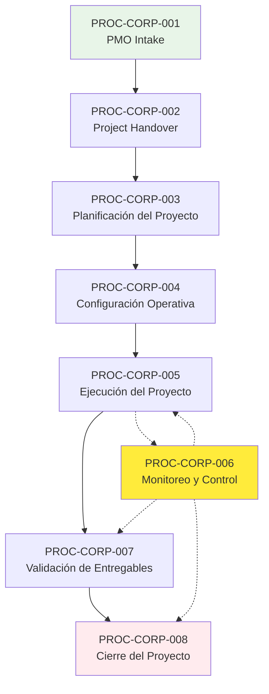
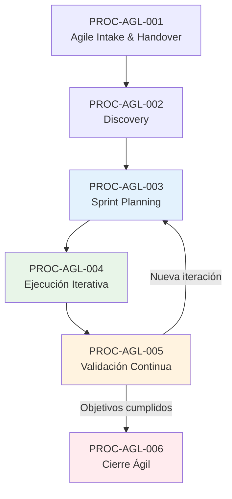

# Inventario Consolidado de Procesos

**Fuente:** Framework Corporativo v3.1 + Framework Ágil v1  
**Fecha:** $(date)  
**Analista:** Kiro PMO Discovery  
**Objetivo:** Catálogo maestro estructurado, normalizado y trazable de todos los procesos identificados

## 1. RESUMEN EJECUTIVO

### 1.1 Frameworks Analizados
- **Framework Corporativo y Proceso de Gestión de Proyectos v3.1** (PMO-FWK-003)
- **Framework Gestión Ágil de Proyectos V1**

### 1.2 Estadísticas del Inventario
- **Framework Corporativo:** 8 procesos principales + 1 flujo detallado
- **Framework Ágil:** 6 procesos principales
- **Procesos totales identificados:** 14 procesos únicos
- **Procesos equivalentes:** 5 pares con equivalencia parcial
- **Procesos exclusivos corporativo:** 4
- **Procesos exclusivos ágil:** 1
- **Duplicidades encontradas:** 0
- **Procesos transversales:** 1 (Monitoreo y Control)

### 1.3 Metodología de Catalogación
- **IDs estables:** PROC-CORP-XXX y PROC-AGL-XXX
- **Trazabilidad:** Cada proceso enlazado a fuente documental
- **Relaciones:** Mapeo de equivalencias sin fusión de frameworks
- **Normalización:** Separación clara entre proceso, fase, actividad, artefacto

## 2. CATÁLOGO MAESTRO - FRAMEWORK CORPORATIVO

### 2.1 PROC-CORP-001: PMO Intake
- **ID Proceso:** PROC-CORP-001
- **Nombre oficial:** PMO Intake
- **Framework:** Framework Corporativo v3.1
- **Versión:** 3.1
- **Fase ID:** PHA-CORP-001
- **Fase:** PMO Intake
- **Descripción:** Recepción formal del proyecto posterior a la aprobación comercial
- **Objetivo:** Validar información base y registrar proyecto en portafolio organizacional
- **Trigger:** Proyecto aprobado comercialmente
- **Inputs:** 
  - Proyecto aprobado comercialmente
  - Información base (alcance, SOW, costos, horas, plazos, entregables)
- **Actividades principales:**
  - Validación información base
  - Revisión arquitectura preliminar y criterios aceptación
  - Análisis supuestos, restricciones y complejidad
  - Registro en portafolio organizacional
  - Clasificación según criticidad, tipo ejecución y prioridad
  - Definición Jefe de Proyecto
  - Asignación Cloud Team
- **Responsable principal:** PMO
- **Roles participantes:** PMO, Líder de Jefes de Proyecto
- **Outputs:** Proyecto registrado, clasificado y asignado
- **Entregables:** Proyecto validado para handover
- **Artefactos relacionados:** ART-CORP-001 (Información Base del Proyecto)
- **Controles relacionados:** CTRL-CORP-001 (Control de entrada PMO)
- **Gates/Checkpoints:** Validación requisitos mínimos
- **Herramientas relacionadas:** Asana (creación proyecto base), Timetracker (creación proyecto)
- **Frecuencia:** Por proyecto (inicio)
- **Obligatoriedad:** OBLIGATORIO
- **Dependencias:** Aprobación comercial
- **Proceso anterior:** (Proceso comercial - fuera del framework)
- **Proceso siguiente:** PROC-CORP-002 (Project Handover)
- **Fuente documental:** Framework Corporativo v3.1
- **Sección:** 6.1 PMO Intake
- **Página:** 19-20
- **Observaciones:** Proceso de entrada crítico, determina viabilidad del proyecto
### 2.2 PROC-CORP-002: Project Handover
- **ID Proceso:** PROC-CORP-002
- **Nombre oficial:** Project Handover
- **Framework:** Framework Corporativo v3.1
- **Versión:** 3.1
- **Fase ID:** PHA-CORP-002
- **Fase:** Project Handover
- **Descripción:** Formalizar transición desde fase comercial hacia operación
- **Objetivo:** Transferencia estructurada de conocimiento y validación de consistencia
- **Trigger:** PMO Intake completado
- **Inputs:** Proyecto validado por PMO
- **Actividades principales:**
  - Transferencia conocimiento comercial
  - Validación consistencia SOW vs capacidad
  - Revisión alcance, entregables, dependencias
  - Análisis riesgos iniciales, restricciones, supuestos
  - Revisión arquitectura propuesta
  - Predefinición Cloud Team
  - Sesiones Pre-Kickoff interno
- **Responsable principal:** Líder de Jefes de Proyecto
- **Roles participantes:** PMO, Líder de Jefes de Proyecto, Project Manager, Cloud Team
- **Outputs:** Proyecto transferido y comprendido
- **Entregables:** Proyecto listo para planificación
- **Artefactos relacionados:** ART-CORP-017 (SOW), sesiones Pre-Kickoff
- **Controles relacionados:** CTRL-CORP-002 (Control de transferencia)
- **Gates/Checkpoints:** Validación transferencia completa
- **Herramientas relacionadas:** Información no definida en el Framework
- **Frecuencia:** Por proyecto (una vez)
- **Obligatoriedad:** OBLIGATORIO
- **Dependencias:** PROC-CORP-001 completado
- **Proceso anterior:** PROC-CORP-001 (PMO Intake)
- **Proceso siguiente:** PROC-CORP-003 (Planificación del Proyecto)
- **Fuente documental:** Framework Corporativo v3.1
- **Sección:** 6.2 Project Handover
- **Página:** 20-21
- **Observaciones:** Rol crítico del Líder JP como enlace entre PMO y PM
### 2.3 PROC-CORP-003: Planificación del Proyecto
- **ID Proceso:** PROC-CORP-003
- **Nombre oficial:** Planificación del Proyecto
- **Framework:** Framework Corporativo v3.1
- **Versión:** 3.1
- **Fase ID:** PHA-CORP-003
- **Fase:** Planificación del Proyecto
- **Descripción:** Transformar alcance contractual en modelo operativo controlable
- **Objetivo:** Crear línea base aprobada para control del proyecto
- **Trigger:** Handover completado
- **Inputs:** Proyecto transferido
- **Actividades principales:**
  - Construcción WBS
  - Estimación horas
  - Secuenciación actividades
  - Desarrollo cronograma
  - Identificación riesgos iniciales
  - Definición dependencias
  - Identificación hitos contractuales
  - Planificación comunicación
  - Validación con Cloud Team
- **Responsable principal:** Project Manager
- **Roles participantes:** Project Manager, Cloud Team, Líder de Jefes de Proyecto
- **Outputs:** Línea base aprobada
- **Entregables:** Planificación completa y aprobada
- **Artefactos relacionados:** 
  - ART-CORP-002 (WBS)
  - ART-CORP-003 (Cronograma)
  - ART-CORP-004 (Plan de Comunicación)
  - ART-CORP-005 (Línea Base)
  - ART-CORP-020 (Matriz de Escalamiento)
- **Controles relacionados:** CTRL-CORP-003 (Control de planificación)
- **Gates/Checkpoints:** Aprobación línea base
- **Herramientas relacionadas:** Google Sheets, Excel, Microsoft Project (complementario)
- **Frecuencia:** Por proyecto (una vez, con actualizaciones)
- **Obligatoriedad:** OBLIGATORIO
- **Dependencias:** PROC-CORP-002 completado
- **Proceso anterior:** PROC-CORP-002 (Project Handover)
- **Proceso siguiente:** PROC-CORP-004 (Configuración Operativa)
- **Fuente documental:** Framework Corporativo v3.1
- **Sección:** 6.3 Planificación del Proyecto
- **Página:** 21-22
- **Observaciones:** Enfoque dual (Ágil vs Tradicional) según tipo de proyecto
### 2.4 PROC-CORP-004: Configuración Operativa
- **ID Proceso:** PROC-CORP-004
- **Nombre oficial:** Configuración Operativa
- **Framework:** Framework Corporativo v3.1
- **Versión:** 3.1
- **Fase ID:** PHA-CORP-004
- **Fase:** Configuración Operativa
- **Descripción:** Transformar línea base en estructura ejecutable y controlable
- **Objetivo:** Convertir planificación en estructura operativa lista para ejecución
- **Trigger:** Planificación aprobada
- **Inputs:** Línea base aprobada
- **Actividades principales:**
  - Creación del proyecto en Asana
  - Configuración de fases
  - Carga de tareas y subtareas
  - Asignación de responsables
  - Configuración dependencias
  - Registro de horas en Timetracker
  - Definición de hitos
  - Activación de dashboards
- **Responsable principal:** Project Manager
- **Roles participantes:** Project Manager, Cloud Team
- **Outputs:** Estructura operativa configurada
- **Entregables:** Proyecto listo para ejecución
- **Artefactos relacionados:**
  - ART-CORP-012 (Proyecto Base en Asana)
  - ART-CORP-013 (Estructura por Fases)
  - ART-CORP-014 (Planificación Operativa)
  - ART-CORP-015 (Milestones)
  - ART-CORP-016 (Dashboards y Vistas Operativas)
- **Controles relacionados:** Validación configuración
- **Gates/Checkpoints:** Setup operativo completo
- **Herramientas relacionadas:** Asana (principal), Timetracker, Google Sheets, Excel, Microsoft Project
- **Frecuencia:** Por proyecto (una vez)
- **Obligatoriedad:** OBLIGATORIO
- **Dependencias:** PROC-CORP-003 completado
- **Proceso anterior:** PROC-CORP-003 (Planificación del Proyecto)
- **Proceso siguiente:** PROC-CORP-005 (Ejecución del Proyecto)
- **Fuente documental:** Framework Corporativo v3.1
- **Sección:** 6.4 Configuración Operativa
- **Página:** 22
- **Observaciones:** Asana como herramienta central de operación
### 2.5 PROC-CORP-005: Ejecución del Proyecto
- **ID Proceso:** PROC-CORP-005
- **Nombre oficial:** Ejecución del Proyecto
- **Framework:** Framework Corporativo v3.1
- **Versión:** 3.1
- **Fase ID:** PHA-CORP-005
- **Fase:** Ejecución del Proyecto
- **Descripción:** Desarrollar actividades necesarias para cumplir alcance comprometido
- **Objetivo:** Implementación activa del proyecto
- **Trigger:** Configuración completada
- **Inputs:** Proyecto configurado
- **Actividades principales:**
  - Coordinación Cloud Team
  - Gestión dependencias
  - Alineación con cliente y stakeholders
  - Supervisión cumplimiento hitos
  - Control de avance
  - Gestión de calidad
  - Resolución de bloqueos
- **Responsable principal:** Project Manager
- **Roles participantes:** Project Manager, Cloud Team, Stakeholders, Cliente
- **Outputs:** Alcance ejecutado
- **Entregables:** Implementación del proyecto según alcance
- **Artefactos relacionados:** Entregables técnicos, reportería de avance
- **Controles relacionados:** CTRL-CORP-004 (Monitoreo Continuo)
- **Gates/Checkpoints:** Hitos del proyecto
- **Herramientas relacionadas:** Asana, Timetracker, herramientas de comunicación
- **Frecuencia:** Continua durante ejecución
- **Obligatoriedad:** OBLIGATORIO
- **Dependencias:** PROC-CORP-004 completado
- **Proceso anterior:** PROC-CORP-004 (Configuración Operativa)
- **Proceso siguiente:** PROC-CORP-007 (Validación de Entregables)
- **Fuente documental:** Framework Corporativo v3.1
- **Sección:** 6.5 Ejecución del Proyecto
- **Página:** 23
- **Observaciones:** Proceso central de implementación, coordina con PROC-CORP-006
### 2.6 PROC-CORP-006: Monitoreo y Control
- **ID Proceso:** PROC-CORP-006
- **Nombre oficial:** Monitoreo y Control
- **Framework:** Framework Corporativo v3.1
- **Versión:** 3.1
- **Fase ID:** PHA-CORP-006
- **Fase:** Monitoreo y Control
- **Descripción:** Seguimiento continuo durante toda la ejecución
- **Objetivo:** Control permanente y toma de decisiones oportuna
- **Trigger:** Ejecución iniciada
- **Inputs:** Proyecto en ejecución
- **Actividades principales:**
  - Reportería continua
  - Control de hitos
  - Gestión de riesgos
  - Control consumo HH
  - Gestión de cambios
  - Cumplimiento cronograma
- **Responsable principal:** Project Manager (operativo), Líder JP (táctico), PMO (estratégico)
- **Roles participantes:** Project Manager, Líder de Jefes de Proyecto, PMO, Cloud Team
- **Outputs:** Control permanente
- **Entregables:** Reportes, dashboards, control de desviaciones
- **Artefactos relacionados:**
  - ART-CORP-022 (Reportería Semanal)
  - ART-CORP-023 (Gestión de Cambios - CPP)
  - ART-CORP-016 (Dashboards y Vistas Operativas)
- **Controles relacionados:** CTRL-CORP-004 (Control de seguimiento)
- **Gates/Checkpoints:** Revisiones periódicas, escalamientos
- **Herramientas relacionadas:** Asana, Timetracker, dashboards, herramientas de reportería
- **Frecuencia:** TRANSVERSAL (continua durante ejecución)
- **Obligatoriedad:** OBLIGATORIO
- **Dependencias:** PROC-CORP-005 iniciado
- **Proceso anterior:** Paralelo a PROC-CORP-005 (Ejecución)
- **Proceso siguiente:** Continúa hasta cierre
- **Fuente documental:** Framework Corporativo v3.1
- **Sección:** 6.6 Monitoreo y Control
- **Página:** 23
- **Observaciones:** Proceso TRANSVERSAL, opera durante toda la ejecución
### 2.7 PROC-CORP-007: Validación de Entregables
- **ID Proceso:** PROC-CORP-007
- **Nombre oficial:** Validación de Entregables
- **Framework:** Framework Corporativo v3.1
- **Versión:** 3.1
- **Fase ID:** PHA-CORP-007
- **Fase:** Validación de Entregables
- **Descripción:** Asegurar cumplimiento de alcance y aceptación
- **Objetivo:** Validación y aceptación formal de entregables
- **Trigger:** Entregables completados
- **Inputs:** Entregables desarrollados
- **Actividades principales:**
  - Revisión técnica
  - Validación funcional
  - Aprobación cliente
  - Confirmación criterios aceptación
  - Control contractual entregables
- **Responsable principal:** Project Manager
- **Roles participantes:** Project Manager, Cloud Team, Cliente, Stakeholders
- **Outputs:** Entregables validados y aceptados
- **Entregables:** Aceptación formal del cliente
- **Artefactos relacionados:** Criterios de aceptación, evidencias de validación
- **Controles relacionados:** CTRL-CORP-005 (Control de aceptación)
- **Gates/Checkpoints:** Aprobación formal del cliente
- **Herramientas relacionadas:** Información no definida en el Framework
- **Frecuencia:** Por entregable (según cronograma)
- **Obligatoriedad:** OBLIGATORIO
- **Dependencias:** PROC-CORP-005 (entregables completados)
- **Proceso anterior:** PROC-CORP-005 (Ejecución del Proyecto)
- **Proceso siguiente:** PROC-CORP-008 (Cierre del Proyecto)
- **Fuente documental:** Framework Corporativo v3.1
- **Sección:** 6.7 Validación de Entregables
- **Página:** 23-24
- **Observaciones:** Puede ocurrir múltiples veces durante el proyecto
### 2.8 PROC-CORP-008: Cierre del Proyecto
- **ID Proceso:** PROC-CORP-008
- **Nombre oficial:** Cierre del Proyecto
- **Framework:** Framework Corporativo v3.1
- **Versión:** 3.1
- **Fase ID:** PHA-CORP-008
- **Fase:** Cierre del Proyecto
- **Descripción:** Formalizar finalización y consolidación completa de resultados
- **Objetivo:** Proyecto formalmente cerrado bajo criterios control y trazabilidad
- **Trigger:** Entregables validados
- **Inputs:** Entregables validados y aceptados
- **Actividades principales:**
  - Validación final entregables
  - Aprobación cliente
  - Consolidación documental
  - Documentación técnica final
  - Arquitectura implementada
  - Manuales operativos
  - Presentación ejecutiva
  - Lecciones aprendidas
  - Transferencia operacional
  - Validación financiera
  - Control HH
  - Facturación
  - Cierre administrativo
- **Responsable principal:** Project Manager
- **Roles participantes:** Project Manager, Cloud Team, PMO, Líder de Jefes de Proyecto
- **Outputs:** Proyecto cerrado
- **Entregables:** Cierre formal y completo
- **Artefactos relacionados:**
  - ART-CORP-006 (Documentación Técnica Final)
  - ART-CORP-007 (Arquitectura Implementada)
  - ART-CORP-008 (Manuales Operativos)
  - ART-CORP-009 (Presentación Ejecutiva)
  - ART-CORP-010 (Lecciones Aprendidas)
  - ART-CORP-024 (Evidencias)
- **Controles relacionados:** CTRL-CORP-006 (Control de cierre)
- **Gates/Checkpoints:** Cierre formal validado
- **Herramientas relacionadas:** Asana, Timetracker (cierre), herramientas documentales
- **Frecuencia:** Por proyecto (una vez)
- **Obligatoriedad:** OBLIGATORIO
- **Dependencias:** PROC-CORP-007 completado
- **Proceso anterior:** PROC-CORP-007 (Validación de Entregables)
- **Proceso siguiente:** (Fin del ciclo de vida)
- **Fuente documental:** Framework Corporativo v3.1
- **Sección:** 6.8 Cierre del Proyecto
- **Página:** 24
- **Observaciones:** Proceso integral de cierre con múltiples dimensiones
## 3. CATÁLOGO MAESTRO - FRAMEWORK ÁGIL

### 3.1 PROC-AGL-001: Agile Intake & Handover
- **ID Proceso:** PROC-AGL-001
- **Nombre oficial:** Agile Intake & Handover
- **Framework:** Framework Ágil v1
- **Versión:** V1
- **Fase ID:** PHA-AGL-001
- **Fase:** Agile Intake & Handover
- **Descripción:** Recepción, validación y transferencia operativa de la iniciativa ágil
- **Objetivo:** Asegurar que el proyecto ingrese correctamente estructurado al framework ágil
- **Trigger:** Requerimiento comercial (iniciativa ágil)
- **Inputs:** 
  - Requerimiento comercial
  - Información comercial y técnica
- **Actividades principales:**
  - Consolidar requerimiento comercial
  - Definir objetivos preliminares
  - Establecer alcance esperado
  - Identificar contexto del cliente
  - Mapear stakeholders involucrados
  - Definir sponsor y contraparte técnica
  - Estimar plazos (≤4 semanas)
  - Definir entregables esperados
  - Asignar equipo (preventa, PM, Cloud Team)
  - Transferir información comercial y técnica
  - Identificar antecedentes técnicos, expectativas, restricciones
  - Mapear riesgos iniciales y dependencias
- **Responsable principal:** Equipo comercial → Equipo operativo
- **Roles participantes:** Comercial, PMO, Project Manager, Cloud Team
- **Outputs:** Proyecto estructurado para framework ágil
- **Entregables:** Iniciativa lista para discovery
- **Artefactos relacionados:** Requerimiento comercial, información de contexto
- **Controles relacionados:** Validación inicial de viabilidad
- **Gates/Checkpoints:** Readiness para inicio ágil
- **Herramientas relacionadas:** Información no definida en el Framework
- **Frecuencia:** Por iniciativa (una vez)
- **Obligatoriedad:** OBLIGATORIO
- **Dependencias:** Decisión de usar framework ágil
- **Proceso anterior:** (Proceso comercial)
- **Proceso siguiente:** PROC-AGL-002 (Discovery)
- **Fuente documental:** Framework Ágil v1
- **Sección:** 7.1 Agile Intake & Handover
- **Página:** Sección 7.1
- **Observaciones:** Duración objetivo ≤4 semanas para toda la iniciativa
### 3.2 PROC-AGL-002: Discovery Ágil
- **ID Proceso:** PROC-AGL-002
- **Nombre oficial:** Discovery
- **Framework:** Framework Ágil v1
- **Versión:** V1
- **Fase ID:** PHA-AGL-002
- **Fase:** Discovery
- **Descripción:** Levantamiento detallado de requerimientos y contexto
- **Objetivo:** Comprensión profunda de requerimientos y priorización inicial
- **Trigger:** Agile Intake completado
- **Inputs:** Información transferida del intake
- **Actividades principales:**
  - Workshops con cliente
  - Levantamiento requerimientos con stakeholders
  - Identificación dependencias
  - Priorización inicial
- **Responsable principal:** Project Manager
- **Roles participantes:** Project Manager, Cloud Team, Cliente, Stakeholders
- **Outputs:** Requerimientos levantados y priorizados
- **Entregables:** Requerimientos clarificados para sprint planning
- **Artefactos relacionados:** Workshops, requerimientos documentados
- **Controles relacionados:** Validación completitud discovery
- **Gates/Checkpoints:** Requerimientos suficientes para planificación
- **Herramientas relacionadas:** Workshops, herramientas de colaboración
- **Frecuencia:** Por iniciativa (una vez, con iteraciones posibles)
- **Obligatoriedad:** OBLIGATORIO
- **Dependencias:** PROC-AGL-001 completado
- **Proceso anterior:** PROC-AGL-001 (Agile Intake & Handover)
- **Proceso siguiente:** PROC-AGL-003 (Sprint Planning)
- **Fuente documental:** Framework Ágil v1
- **Sección:** 7.2 Discovery
- **Página:** Sección 7.2
- **Observaciones:** Proceso específico del framework ágil, no existe en corporativo
### 3.3 PROC-AGL-003: Sprint Planning
- **ID Proceso:** PROC-AGL-003
- **Nombre oficial:** Sprint Planning
- **Framework:** Framework Ágil v1
- **Versión:** V1
- **Fase ID:** PHA-AGL-003
- **Fase:** Sprint Planning
- **Descripción:** Construcción y priorización del backlog
- **Objetivo:** Crear backlog priorizado y asignado para ejecución
- **Trigger:** Discovery completado
- **Inputs:** Requerimientos priorizados
- **Actividades principales:**
  - Construcción backlog
  - Priorización tareas
  - Asignación de tareas y responsables
  - Definición entregables
- **Responsable principal:** Project Manager
- **Roles participantes:** Project Manager, Cloud Team, Product Owner Cliente (si aplica)
- **Outputs:** Backlog construido y priorizado
- **Entregables:** Plan de sprint con backlog asignado
- **Artefactos relacionados:** ART-AGL-001 (Backlog del Proyecto)
- **Controles relacionados:** Validación viabilidad del sprint
- **Gates/Checkpoints:** Backlog ready para ejecución
- **Herramientas relacionadas:** Información no definida en el Framework
- **Frecuencia:** Por sprint (recurrente durante iniciativa)
- **Obligatoriedad:** OBLIGATORIO
- **Dependencias:** PROC-AGL-002 completado
- **Proceso anterior:** PROC-AGL-002 (Discovery)
- **Proceso siguiente:** PROC-AGL-004 (Ejecución Iterativa)
- **Fuente documental:** Framework Ágil v1
- **Sección:** 7.3 Sprint Planning
- **Página:** Sección 7.3
- **Observaciones:** Proceso recurrente, puede repetirse múltiples veces
### 3.4 PROC-AGL-004: Ejecución Iterativa
- **ID Proceso:** PROC-AGL-004
- **Nombre oficial:** Ejecución Iterativa
- **Framework:** Framework Ágil v1
- **Versión:** V1
- **Fase ID:** PHA-AGL-004
- **Fase:** Ejecución Iterativa
- **Descripción:** Desarrollo progresivo con entregas incrementales y validaciones continuas
- **Objetivo:** Ejecutar backlog con entregas incrementales y adaptación rápida
- **Trigger:** Sprint planning completado
- **Inputs:** Backlog priorizado
- **Actividades principales:**
  - Desarrollo técnico
  - Configuración
  - Workshops
  - Validaciones
  - Seguimiento continuo
- **Responsable principal:** Cloud Team
- **Roles participantes:** Cloud Team, Project Manager, Cliente, Stakeholders
- **Outputs:** Entregas incrementales
- **Entregables:** Incrementos funcionales del producto/solución
- **Artefactos relacionados:** ART-AGL-002 (Entregables Técnicos)
- **Controles relacionados:** Seguimiento continuo de avance
- **Gates/Checkpoints:** Entregas incrementales validadas
- **Herramientas relacionadas:** Herramientas de desarrollo, colaboración
- **Frecuencia:** RECURRENTE (múltiples iteraciones)
- **Obligatoriedad:** OBLIGATORIO
- **Dependencias:** PROC-AGL-003 completado
- **Proceso anterior:** PROC-AGL-003 (Sprint Planning)
- **Proceso siguiente:** PROC-AGL-005 (Validación Continua)
- **Fuente documental:** Framework Ágil v1
- **Sección:** 7.4 Ejecución Iterativa
- **Página:** Sección 7.4
- **Observaciones:** Proceso iterativo, coordinación permanente con cliente
### 3.5 PROC-AGL-005: Validación Continua
- **ID Proceso:** PROC-AGL-005
- **Nombre oficial:** Validación Continua
- **Framework:** Framework Ágil v1
- **Versión:** V1
- **Fase ID:** PHA-AGL-005
- **Fase:** Validación Continua
- **Descripción:** Validación incremental con stakeholders
- **Objetivo:** Obtener feedback continuo y ajustar backlog según necesidades
- **Trigger:** Entregas incrementales disponibles
- **Inputs:** Entregas incrementales
- **Actividades principales:**
  - Demos con cliente
  - Feedback cliente
  - Ajustes backlog
  - Validación entregables
- **Responsable principal:** Project Manager
- **Roles participantes:** Project Manager, Cloud Team, Cliente, Product Owner (si aplica)
- **Outputs:** Feedback y ajustes
- **Entregables:** Backlog actualizado, validaciones registradas
- **Artefactos relacionados:** Feedback de demos, backlog actualizado
- **Controles relacionados:** Validación incremental de valor
- **Gates/Checkpoints:** Aprobación incremental del cliente
- **Herramientas relacionadas:** Herramientas de demo, colaboración
- **Frecuencia:** RECURRENTE (por iteración)
- **Obligatoriedad:** OBLIGATORIO
- **Dependencias:** PROC-AGL-004 (entregas disponibles)
- **Proceso anterior:** PROC-AGL-004 (Ejecución Iterativa)
- **Proceso siguiente:** PROC-AGL-003 (Sprint Planning - nueva iteración) o PROC-AGL-006 (Cierre)
- **Fuente documental:** Framework Ágil v1
- **Sección:** 7.5 Validación Continua
- **Página:** Sección 7.5
- **Observaciones:** Proceso cíclico, puede llevar a nueva planificación o cierre
### 3.6 PROC-AGL-006: Cierre Ágil
- **ID Proceso:** PROC-AGL-006
- **Nombre oficial:** Cierre Ágil
- **Framework:** Framework Ágil v1
- **Versión:** V1
- **Fase ID:** PHA-AGL-006
- **Fase:** Cierre Ágil
- **Descripción:** Validación final y formalización de entregables
- **Objetivo:** Cerrar iniciativa ágil con documentación mínima y aprendizajes
- **Trigger:** Objetivos de iniciativa cumplidos
- **Inputs:** Entregables validados
- **Actividades principales:**
  - Consolidación de resultados
  - Presentación ejecutiva de cierre
  - Validación entregables técnicos
  - Transferencia de conocimiento
  - Documentación generada
  - Lecciones aprendidas
  - Identificación de mejoras
  - Definición posibles iniciativas futuras
- **Responsable principal:** Project Manager
- **Roles participantes:** Project Manager, Cloud Team, Cliente
- **Outputs:** Iniciativa cerrada y documentada
- **Entregables:** Cierre formal con documentación mínima
- **Artefactos relacionados:**
  - ART-AGL-002 (Entregables Técnicos)
  - ART-AGL-003 (Presentación Ejecutiva de Cierre)
  - ART-AGL-004 (Lecciones Aprendidas Ágiles)
- **Controles relacionados:** Validación cierre simplificado
- **Gates/Checkpoints:** Cierre formal validado
- **Herramientas relacionadas:** Herramientas de documentación mínima
- **Frecuencia:** Por iniciativa (una vez)
- **Obligatoriedad:** OBLIGATORIO
- **Dependencias:** Objetivos de iniciativa cumplidos
- **Proceso anterior:** PROC-AGL-005 (Validación Continua)
- **Proceso siguiente:** (Fin del ciclo ágil)
- **Fuente documental:** Framework Ágil v1
- **Sección:** 7.6 Cierre
- **Página:** Sección 7.6
- **Observaciones:** Cierre simplificado vs corporativo, enfoque en aprendizajes
## 4. MAPA DE PROCESOS CORPORATIVO

### 4.1 Secuencia Principal

### 4.2 Clasificación de Procesos Corporativo
- **Secuenciales:** PROC-CORP-001 → 002 → 003 → 004 → 005 → 007 → 008
- **Transversales:** PROC-CORP-006 (Monitoreo y Control)
- **Recurrentes:** PROC-CORP-006, PROC-CORP-007 (por entregable)
- **Condicionales:** Ninguno identificado explícitamente
## 5. MAPA DE PROCESOS ÁGIL

### 5.1 Secuencia Iterativa

### 5.2 Clasificación de Procesos Ágil
- **Secuenciales:** PROC-AGL-001 → 002 → 003
- **Iterativos:** PROC-AGL-003 ↔ 004 ↔ 005 (ciclo repetitivo)
- **Recurrentes:** PROC-AGL-003, PROC-AGL-004, PROC-AGL-005
- **Condicionales:** PROC-AGL-005 (determina nueva iteración vs cierre)

## 6. SOLAPAMIENTOS Y EQUIVALENCIAS

### 6.1 Matriz de Equivalencias

| Proceso Corporativo | Proceso Ágil | Relación | Nivel de Equivalencia | Observación |
|-------------------|--------------|----------|----------------------|-------------|
| PROC-CORP-001 (PMO Intake) | PROC-AGL-001 (Agile Intake & Handover) | PARCIALMENTE EQUIVALENTE | 60% | Ágil fusiona intake + handover |
| PROC-CORP-002 (Project Handover) | PROC-AGL-001 (Agile Intake & Handover) | PARCIALMENTE EQUIVALENTE | 40% | Integrado en proceso ágil |
| PROC-CORP-003 (Planificación) | PROC-AGL-003 (Sprint Planning) | PARCIALMENTE EQUIVALENTE | 50% | Enfoque: completa vs iterativa |
| (No existe) | PROC-AGL-002 (Discovery) | EXCLUSIVO ÁGIL | N/A | Proceso específico ágil |
| PROC-CORP-004 (Configuración Operativa) | (Implícito en ejecución) | NO COMPARABLE | N/A | Corporativo más formal |
| PROC-CORP-005 (Ejecución) | PROC-AGL-004 (Ejecución Iterativa) | PARCIALMENTE EQUIVALENTE | 70% | Enfoque: tradicional vs iterativo |
| PROC-CORP-006 (Monitoreo y Control) | PROC-AGL-005 (Validación Continua) | PARCIALMENTE EQUIVALENTE | 50% | Control formal vs validación ágil |
| PROC-CORP-007 (Validación Entregables) | PROC-AGL-005 (Validación Continua) | PARCIALMENTE EQUIVALENTE | 60% | Formal vs continua |
| PROC-CORP-008 (Cierre) | PROC-AGL-006 (Cierre Ágil) | PARCIALMENTE EQUIVALENTE | 40% | Formal completo vs simplificado |
### 6.2 Procesos Exclusivos

#### **Exclusivos Framework Corporativo:**
- **PROC-CORP-002:** Project Handover (separado del intake)
- **PROC-CORP-004:** Configuración Operativa (setup formal en herramientas)
- **PROC-CORP-006:** Monitoreo y Control (proceso transversal formal)
- **PROC-CORP-007:** Validación de Entregables (proceso separado de cierre)

#### **Exclusivos Framework Ágil:**
- **PROC-AGL-002:** Discovery (levantamiento específico ágil)

### 6.3 Procesos Complementarios
Ningún proceso identificado como complementario directo entre frameworks.

## 7. DUPLICIDADES IDENTIFICADAS

### 7.1 Análisis de Duplicidades
**Resultado:** 0 duplicidades encontradas dentro de cada framework.

**Validación:**
- Framework Corporativo: Cada proceso tiene propósito único y diferenciado
- Framework Ágil: Cada proceso tiene rol específico en el ciclo iterativo
- No se identificaron nombres diferentes para mismo proceso
- No se encontraron actividades presentadas como procesos independientes
- No se detectaron procesos repetidos entre capítulos

## 8. MATRIZ CONSOLIDADA FINAL

| ID | Framework | Fase | Proceso | Responsable | Tipo | Artefactos Clave | Controles | Herramientas | Referencia |
|---|-----------|------|---------|-------------|------|------------------|-----------|-------------|------------|
| PROC-CORP-001 | Corporativo v3.1 | PMO Intake | PMO Intake | PMO | SECUENCIAL | ART-CORP-001 | CTRL-CORP-001 | Asana, Timetracker | Pág. 19-20 |
| PROC-CORP-002 | Corporativo v3.1 | Project Handover | Project Handover | Líder JP | SECUENCIAL | ART-CORP-017 | CTRL-CORP-002 | No definido | Pág. 20-21 |
| PROC-CORP-003 | Corporativo v3.1 | Planificación | Planificación del Proyecto | PM | SECUENCIAL | ART-CORP-002,003,004,005,020 | CTRL-CORP-003 | Sheets, Excel, MS Project | Pág. 21-22 |
| PROC-CORP-004 | Corporativo v3.1 | Configuración Operativa | Configuración Operativa | PM | SECUENCIAL | ART-CORP-012,013,014,015,016 | No definido | Asana, Timetracker | Pág. 22 |
| PROC-CORP-005 | Corporativo v3.1 | Ejecución | Ejecución del Proyecto | PM | SECUENCIAL | Entregables técnicos | CTRL-CORP-004 | Asana, Timetracker | Pág. 23 |
| PROC-CORP-006 | Corporativo v3.1 | Monitoreo y Control | Monitoreo y Control | PM/Líder JP/PMO | TRANSVERSAL | ART-CORP-022,023,016 | CTRL-CORP-004 | Asana, Timetracker, dashboards | Pág. 23 |
| PROC-CORP-007 | Corporativo v3.1 | Validación | Validación de Entregables | PM | RECURRENTE | Criterios aceptación | CTRL-CORP-005 | No definido | Pág. 23-24 |
| PROC-CORP-008 | Corporativo v3.1 | Cierre | Cierre del Proyecto | PM | SECUENCIAL | ART-CORP-006,007,008,009,010,024 | CTRL-CORP-006 | Asana, Timetracker | Pág. 24 |
| PROC-AGL-001 | Ágil v1 | Agile Intake | Agile Intake & Handover | Comercial→Operativo | SECUENCIAL | Req. comercial | Validación viabilidad | No definido | Secc. 7.1 |
| PROC-AGL-002 | Ágil v1 | Discovery | Discovery | PM | SECUENCIAL | Workshops, requerimientos | Validación completitud | Workshops | Secc. 7.2 |
| PROC-AGL-003 | Ágil v1 | Sprint Planning | Sprint Planning | PM | RECURRENTE | ART-AGL-001 | Validación viabilidad | No definido | Secc. 7.3 |
| PROC-AGL-004 | Ágil v1 | Ejecución Iterativa | Ejecución Iterativa | Cloud Team | RECURRENTE | ART-AGL-002 | Seguimiento continuo | Desarrollo, colaboración | Secc. 7.4 |
| PROC-AGL-005 | Ágil v1 | Validación Continua | Validación Continua | PM | RECURRENTE | Feedback, backlog actualizado | Validación incremental | Demo, colaboración | Secc. 7.5 |
| PROC-AGL-006 | Ágil v1 | Cierre Ágil | Cierre Ágil | PM | SECUENCIAL | ART-AGL-002,003,004 | Validación cierre | Documentación mínima | Secc. 7.6 |
## 9. ESTADÍSTICAS FINALES

### 9.1 Framework Corporativo v3.1
- **Número de fases:** 8
- **Procesos principales:** 8
- **Procesos secuenciales:** 7
- **Procesos transversales:** 1
- **Procesos recurrentes:** 2 (PROC-CORP-006, PROC-CORP-007)
- **Procesos condicionales:** 0
- **Artefactos relacionados:** 24+
- **Controles formales:** 6
- **Herramientas documentadas:** 11

### 9.2 Framework Ágil v1
- **Número de fases:** 6
- **Procesos principales:** 6
- **Procesos secuenciales:** 3
- **Procesos iterativos/recurrentes:** 3 (PROC-AGL-003, PROC-AGL-004, PROC-AGL-005)
- **Procesos condicionales:** 1 (PROC-AGL-005 determina iteración vs cierre)
- **Artefactos relacionados:** 4+
- **Controles informales:** 6
- **Herramientas documentadas:** 0 (no especificadas)

### 9.3 Análisis Comparativo
- **Procesos equivalentes:** 5 pares (con equivalencia parcial)
- **Procesos parcialmente equivalentes:** 5 pares (50-70% equivalencia)
- **Procesos exclusivos corporativo:** 4
- **Procesos exclusivos ágil:** 1
- **Duplicidades encontradas:** 0
- **Gaps metodológicos:** Multiple (detallados en análisis previos)

## 10. CONTROL DE CALIDAD

### 10.1 Verificación Completitud
✅ **Todo proceso posee un Framework:** Verificado
✅ **Todo proceso posee una fase:** Verificado  
✅ **Todo proceso posee referencia documental:** Verificado
✅ **Ningún proceso fue inventado:** Verificado - todos basados en fuentes oficiales
✅ **Ningún artefacto convertido en proceso:** Verificado - clara separación conceptual
✅ **Ninguna herramienta convertida en proceso:** Verificado - herramientas como soporte
✅ **Relaciones no crean nuevas reglas metodológicas:** Verificado - solo mapeo analítico

### 10.2 Validación de Integridad
- **IDs únicos:** 14 procesos con IDs estables únicos
- **Trazabilidad:** Cada proceso enlazado a fuente documental específica
- **Consistencia:** Separación clara entre Framework Corporativo y Ágil
- **Completitud:** Todos los procesos identificados en ambos frameworks catalogados

## 11. OBSERVACIONES FINALES

### 11.1 Hallazgos Principales
1. **Complementariedad confirmada:** Los frameworks no duplican procesos, se complementan
2. **Diferentes filosofías:** Corporativo (control formal) vs Ágil (adaptabilidad)
3. **Cobertura completa:** Juntos cubren todo el espectro de iniciativas de Morris & Opazo
4. **Governance coherente:** Ambos mantienen estructura organizacional común

### 11.2 Gaps Procesales Identificados
1. **Criterios de selección:** No hay proceso formal para elegir framework
2. **Transición:** No hay proceso para migrar de ágil a corporativo
3. **Governance unificada:** No hay proceso para consolidar KPIs de ambos frameworks
4. **Herramientas ágiles:** Framework ágil no especifica herramientas de soporte

### 11.3 Próximos Pasos Recomendados
1. **Inventario de Artefactos:** Catalogar todos los artefactos identificados
2. **Governance consolidada:** Mapear controles y gates de ambos frameworks  
3. **Roles unificados:** Consolidar matriz de roles y responsabilidades
4. **Herramientas candidatas:** Identificar herramientas web para PMO Framework Hub

---

**Estado:** COMPLETO - Inventario consolidado de procesos  
**Fecha:** $(date)  
**Analista:** Kiro PMO Discovery  
**Próximo paso:** 06-artifact-inventory.md

## RESUMEN EJECUTIVO PARA REVISIÓN PMO

**PROCESOS IDENTIFICADOS:** 14 procesos únicos
- Framework Corporativo: 8 procesos (control formal, proyectos complejos)
- Framework Ágil: 6 procesos (adaptabilidad, iniciativas rápidas ≤4 semanas)

**RELACIÓN:** COMPLEMENTARIOS - no hay duplicidades críticas
**COBERTURA:** Completa para todo tipo de iniciativas Morris & Opazo
**GOVERNANCE:** Estructura organizacional común, controles diferenciados
**SIGUIENTE:** Inventario de artefactos para completar catalogación

**¿Proceder con paso 6 del Discovery?**