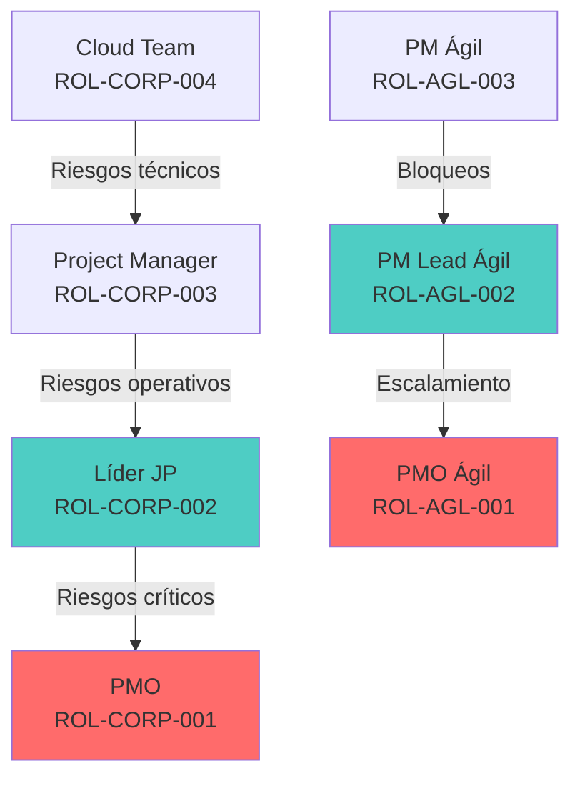

# Inventario Consolidado de Roles y Responsabilidades

**Fuente:** Framework Corporativo v3.1 + Framework Ágil v1  
**Fecha:** $(date)  
**Analista:** Kiro PMO Discovery  
**Objetivo:** Catálogo maestro de roles para PMO Framework Hub

## 1. RESUMEN EJECUTIVO

### 1.1 Frameworks Analizados
- **Framework Corporativo y Proceso de Gestión de Proyectos v3.1** (PMO-FWK-003)
- **Framework Gestión Ágil de Proyectos V1**

### 1.2 Estadísticas del Inventario
- **Roles formales corporativos:** 5 roles documentados
- **Roles formales ágiles:** 5 roles + 1 opcional (Product Owner Cliente)
- **Roles únicos totales:** 6 roles (con equivalencias)
- **Relaciones rol→proceso:** 45 relaciones identificadas
- **Relaciones rol→artefacto:** 38 relaciones identificadas
- **Relaciones rol→governance:** 28 relaciones identificadas
- **Gaps de autoridad:** 4 gaps críticos

### 1.3 Hallazgo Principal
**[FRAMEWORK]** Ambos frameworks mantienen la **misma estructura organizacional base** con roles equivalentes pero **responsabilidades adaptadas** según la metodología (corporativa vs ágil).
## 2. VALIDACIÓN MODELO DE GOVERNANCE

### 2.1 Verificación Niveles vs Roles

**[FRAMEWORK]** Confirmación documentada de la relación Nivel → Rol:

| Nivel | Rol | Clasificación | Fuente | Página | Observación |
|-------|-----|---------------|---------|---------|-------------|
| **Estratégico** | PMO | EXPLÍCITO | Framework Corporativo v3.1 | 11-12 | "Nivel estratégico del framework" |
| **Táctico** | Líder de Jefes de Proyecto | EXPLÍCITO | Framework Corporativo v3.1 | 12-14 | "Nivel táctico del Framework Corporativo" |
| **Operativo** | Project Manager | EXPLÍCITO | Framework Corporativo v3.1 | 14-15 | "Rol operativo central" |

### 2.2 Confirmación Framework Ágil

**[FRAMEWORK]** El Framework Ágil **mantiene la estructura de governance** pero con **adaptaciones**:

| Nivel Ágil | Rol Ágil | Clasificación | Fuente | Observación |
|------------|----------|---------------|---------|-------------|
| **Estratégico** | PMO (Ágil) | DERIVADO | Sección 6.1 | "Gobernar el framework ágil" |
| **Táctico** | PM Lead (Ágil) | DERIVADO | Sección 6.2 | "Supervisar ejecución ágil" |
| **Operativo** | Project Manager (Ágil) | DERIVADO | Sección 6.3 | "Gestión operativa ágil" |

## 3. CATÁLOGO MAESTRO - FRAMEWORK CORPORATIVO

### 3.1 ROL-CORP-001: Project Management Office (PMO)
- **ID:** ROL-CORP-001
- **Nombre oficial:** Project Management Office (PMO)
- **Framework:** Framework Corporativo v3.1
- **Versión:** 3.1
- **Descripción:** Entidad responsable del gobierno del modelo corporativo de gestión de proyectos
- **Propósito:** Asegurar aplicación consistente del framework, estandarización metodológica y visibilidad organizacional
- **Nivel de Governance:** GOV-CORP-001 (Estratégico)
- **Clasificación:** **ESTRATÉGICO** **[FRAMEWORK]**
- **Responsabilidades:**
  - Definir y mantener el framework
  - Liderar el proceso de PMO Intake
  - Validar información base del proyecto
  - Clasificar proyectos según criticidad
  - Consolidar dashboards y KPIs
  - Supervisar cumplimiento metodológico
  - Proveer visibilidad ejecutiva
  - Canalizar el escalamiento organizacional
- **Fases:** PHA-CORP-001 (PMO Intake), PHA-CORP-006 (Monitoreo - nivel estratégico)
- **Procesos:** PROC-CORP-001 (PMO Intake), PROC-CORP-006 (Monitoreo y Control - nivel estratégico)
- **Actividades:**
  - Validación información base
  - Registro del proyecto en portafolio
  - Clasificación por criticidad, tipo, prioridad
  - Asignación PM y Cloud Team
  - Consolidación visibilidad organizacional
- **Artefactos:** ART-CORP-001 (Información Base), ART-CORP-017 (SOW), ART-CORP-018 (NDA)
- **Controles:** CTRL-CORP-001 (Validación PMO Intake)
- **Gates:** GATE-CORP-001 (Entrada al Framework)
- **Aprobaciones:** Entrada de proyectos al framework
- **Reportería:** Consolidación dashboards y KPIs organizacionales
- **Escalamientos:** Receptor final de escalamiento organizacional
- **Herramientas utilizadas:** Sistema PMO, Asana (creación proyecto base), Timetracker (creación proyecto)
- **Interacciones con otros roles:** 
  - → Líder JP: Transferencia proyectos validados
  - ← Líder JP: Recepción escalamientos críticos
- **Referencia documental:** Framework Corporativo v3.1
- **Sección:** 3.2, 4.1
- **Página:** 8-9, 11-12
- **Observaciones:** Rol estratégico único, no ejecuta proyectos sino gobierna el modelo
### 3.2 ROL-CORP-002: Líder de Jefes de Proyecto (PM Lead)
- **ID:** ROL-CORP-002
- **Nombre oficial:** Líder de Jefes de Proyecto (PM Lead / Team Leader de Proyectos)
- **Framework:** Framework Corporativo v3.1
- **Versión:** 3.1
- **Descripción:** Nivel táctico del framework, coordina, supervisa y acompaña la ejecución de proyectos
- **Propósito:** Asegurar calidad de entrada, alineación metodológica y consistencia operacional
- **Nivel de Governance:** GOV-CORP-002 (Táctico)
- **Clasificación:** **TÁCTICO** **[FRAMEWORK]**
- **Responsabilidades:**
  - Liderar el proceso de Handover
  - Validar consistencia entre SOW, alcance y entregables
  - Supervisar al equipo de Project Managers
  - Monitorear la salud operacional del portafolio
  - Detectar desviaciones tempranas
  - Facilitar resolución de bloqueos
  - Asegurar correcta aplicación del framework
  - Validar calidad de planificación y ejecución
  - Escalar riesgos críticos hacia PMO
- **Fases:** PHA-CORP-002 (Project Handover), PHA-CORP-006 (Monitoreo - nivel táctico)
- **Procesos:** PROC-CORP-002 (Project Handover), PROC-CORP-006 (Monitoreo - nivel táctico)
- **Actividades:**
  - Transferencia conocimiento comercial → PM
  - Validación consistencia SOW vs capacidad
  - Sesiones Pre-Kickoff interno
  - Supervisión metodológica continua
  - Detección temprana desviaciones
- **Artefactos:** Sesiones Pre-Kickoff, validación handover
- **Controles:** CTRL-CORP-002 (Control de Transferencia)
- **Checkpoints:** CHK-CORP-001 (Transferencia Validada)
- **Aprobaciones:** **Información no definida en el Framework**
- **Reportería:** **Información no definida en el Framework**
- **Escalamientos:** 
  - ← PM: Recibe escalamientos operativos
  - → PMO: Escala riesgos críticos organizacionales
- **Herramientas utilizadas:** **Información no definida en el Framework**
- **Interacciones con otros roles:**
  - ← PMO: Recibe proyectos validados
  - → PM: Transfiere proyectos para planificación
  - ← PM: Supervisa y apoya continuamente
- **Referencia documental:** Framework Corporativo v3.1
- **Sección:** 3.3, 4.2
- **Página:** 9, 12-14
- **Observaciones:** Rol táctico de enlace, reemplaza funcionalmente al rol PDM

### 3.3 ROL-CORP-003: Project Manager (PM/JP)
- **ID:** ROL-CORP-003
- **Nombre oficial:** Project Manager (PM / JP)
- **Framework:** Framework Corporativo v3.1
- **Versión:** 3.1
- **Descripción:** Responsable directo de la gestión integral del proyecto durante todo su ciclo de vida
- **Propósito:** Coordinar clientes, ingeniería y stakeholders, asegurando cumplimiento de alcance, cronograma, recursos, calidad y riesgos
- **Nivel de Governance:** GOV-CORP-003 (Operativo)
- **Clasificación:** **OPERATIVO** **[FRAMEWORK]**
- **Responsabilidades:**
  - Construir WBS y cronograma
  - Configurar proyecto en Asana
  - Coordinar equipo técnico
  - Gestionar riesgos y cambios
  - Realizar reportería
  - Liderar reuniones
  - Mantener comunicación con cliente
  - Gestionar hitos y entregables
  - Coordinar cierre técnico y administrativo
- **Fases:** PHA-CORP-003 a PHA-CORP-008 (Planificación hasta Cierre)
- **Procesos:** PROC-CORP-003 a PROC-CORP-008 (todos los procesos operativos)
- **Actividades:** [Lista extensa - ver flujo detallado páginas 33-36]
- **Artefactos:** [20+ artefactos - ver relación detallada en siguiente sección]
- **Controles:** CTRL-CORP-003, CTRL-CORP-004, CTRL-CORP-005, CTRL-CORP-006
- **Gates:** GATE-CORP-002 (participante), GATE-CORP-003 (responsable)
- **Aprobaciones:** **Información no definida en el Framework** (para gates)
- **Reportería:** REP-CORP-001 (Reportería Semanal), REP-CORP-003 (Presentación Ejecutiva)
- **Escalamientos:** → Líder JP (escalamiento operativo)
- **Herramientas utilizadas:** Asana, Timetracker, Google Workspace, herramientas comunicación
- **Interacciones con otros roles:**
  - ← Líder JP: Recibe proyectos transferidos
  - ↔ Cloud Team: Coordinación técnica continua
  - ↔ Cliente: Comunicación y validaciones
  - ↔ Stakeholders: Gestión continua
- **Referencia documental:** Framework Corporativo v3.1
- **Sección:** 3.4, 4.3
- **Página:** 10, 14-15
- **Observaciones:** Rol central operativo, "dueño" del proyecto
### 3.4 ROL-CORP-004: Cloud Team (Equipo Técnico)
- **ID:** ROL-CORP-004
- **Nombre oficial:** Equipo Técnico (Cloud Team)
- **Framework:** Framework Corporativo v3.1
- **Versión:** 3.1
- **Descripción:** Arquitectos, ingenieros cloud y especialistas técnicos responsables de ejecutar las actividades técnicas comprometidas
- **Propósito:** Ejecutar implementación técnica del proyecto
- **Nivel de Governance:** **NO DETERMINADO** (rol técnico de soporte)
- **Clasificación:** **TÉCNICO** **[INTERPRETACIÓN]**
- **Responsabilidades:**
  - Ejecutar tareas técnicas
  - Participar en estimación de HH
  - Validar factibilidad técnica
  - Apoyar la construcción del WBS
  - Generar documentación técnica
  - Reportar avance al PM
  - Levantar riesgos técnicos
  - Elaborar IDD
  - Participar en validaciones
- **Fases:** PHA-CORP-001 (asignación), PHA-CORP-003 a PHA-CORP-008 (ejecución técnica)
- **Procesos:** PROC-CORP-003 a PROC-CORP-008 (soporte técnico a procesos operativos)
- **Actividades:**
  - Validación técnica durante planificación
  - Implementación técnica durante ejecución
  - Documentación técnica durante cierre
- **Artefactos:** ART-CORP-006 (Documentación Técnica), ART-CORP-007 (Arquitectura), ART-CORP-008 (Manuales), ART-CORP-011 (IDD), ART-CORP-024 (Evidencias)
- **Controles:** CTRL-CORP-003 (validación técnica), CTRL-CORP-006 (documentación cierre)
- **Gates:** GATE-CORP-002 (validación técnica obligatoria)
- **Aprobaciones:** Validación técnica (no aprobación formal)
- **Reportería:** Reporte de avance al PM
- **Escalamientos:** → PM (riesgos técnicos)
- **Herramientas utilizadas:** Herramientas técnicas (no especificadas), GitHub (código)
- **Interacciones con otros roles:**
  - → PM: Reporte continuo, validaciones técnicas
  - ← PM: Recibe asignaciones y coordinación
  - ↔ Cliente: Validaciones técnicas (cuando aplique)
- **Referencia documental:** Framework Corporativo v3.1
- **Sección:** 3.5
- **Página:** 10-11
- **Observaciones:** Equipo técnico, no rol individual

### 3.5 ROL-CORP-005: Stakeholders del Proyecto
- **ID:** ROL-CORP-005
- **Nombre oficial:** Stakeholders del Proyecto
- **Framework:** Framework Corporativo v3.1
- **Versión:** 3.1
- **Descripción:** Actores internos y externos que tienen algún nivel de interés o impacto en el proyecto
- **Propósito:** Participar según su interés/impacto en el proyecto
- **Nivel de Governance:** **NO DETERMINADO**
- **Clasificación:** **CLIENTE** **[INTERPRETACIÓN]** (actores externos/internos)
- **Responsabilidades:** **Información no definida en el Framework** - "responsabilidades definidas por Project Manager según el proyecto"
- **Fases:** Transversal (según participación requerida)
- **Procesos:** Múltiples (según necesidad)
- **Actividades:** Participación en validaciones, comunicaciones, decisiones
- **Artefactos:** ART-CORP-004 (Plan de Comunicación - como destinatarios)
- **Aprobaciones:** Según definición del PM por proyecto
- **Reportería:** Receptores de comunicación del proyecto
- **Escalamientos:** **Información no definida en el Framework**
- **Herramientas utilizadas:** Herramientas de comunicación
- **Interacciones con otros roles:** ← PM: Gestión de stakeholders
- **Referencia documental:** Framework Corporativo v3.1
- **Sección:** 3.6
- **Página:** 11
- **Observaciones:** Rol genérico, no específico
## 4. CATÁLOGO MAESTRO - FRAMEWORK ÁGIL

### 4.1 ROL-AGL-001: PMO (Ágil)
- **ID:** ROL-AGL-001
- **Nombre oficial:** Project Management Office (Ágil)
- **Framework:** Framework Ágil v1
- **Versión:** V1
- **Descripción:** PMO adaptado para gobierno del framework ágil
- **Propósito:** Gobierno del framework ágil manteniendo flexibilidad y adaptabilidad
- **Nivel de Governance:** GOV-AGL-001 (Estratégico Ágil)
- **Clasificación:** **ESTRATÉGICO** **[DERIVADO]**
- **Responsabilidades:**
  - Gobernar el framework ágil
  - Supervisar salud del portafolio
  - Consolidar KPIs
  - Mantener trazabilidad organizacional
  - Facilitar escalamiento
  - Supervisar cumplimiento metodológico
- **Fases:** **Información no definida en el Framework** (nivel estratégico transversal)
- **Procesos:** **Información no definida en el Framework**
- **Controles:** **Información no definida en el Framework**
- **Reportería:** **Información no definida en el Framework**
- **Escalamientos:** **Información no definida en el Framework**
- **Herramientas utilizadas:** **Información no definida en el Framework**
- **Interacciones con otros roles:** **Información no definida en el Framework**
- **Referencia documental:** Framework Ágil v1
- **Sección:** 6.1
- **Observaciones:** Rol adaptado del corporativo, menos detallado

### 4.2 ROL-AGL-002: PM Lead (Ágil)
- **ID:** ROL-AGL-002
- **Nombre oficial:** PM Lead / Líder de Jefes de Proyecto (Ágil)
- **Framework:** Framework Ágil v1
- **Versión:** V1
- **Descripción:** PM Lead adaptado para supervisión ágil
- **Propósito:** Supervisión y facilitación en entorno ágil
- **Nivel de Governance:** GOV-AGL-002 (Táctico Ágil)
- **Clasificación:** **TÁCTICO** **[DERIVADO]**
- **Responsabilidades:**
  - Supervisar ejecución ágil
  - Facilitar resolución de bloqueos
  - Guiar metodológicamente a los PM
  - Validar alineación operacional
  - Supervisar salud de iniciativas
- **Fases:** **Información no definida en el Framework**
- **Procesos:** **Información no definida en el Framework**
- **Escalamientos:** ← PM: Facilitación de bloqueos
- **Herramientas utilizadas:** **Información no definida en el Framework**
- **Referencia documental:** Framework Ágil v1
- **Sección:** 6.2
- **Observaciones:** Enfoque en facilitación vs control

### 4.3 ROL-AGL-003: Project Manager (Ágil)
- **ID:** ROL-AGL-003
- **Nombre oficial:** Project Manager (Ágil)
- **Framework:** Framework Ágil v1
- **Versión:** V1
- **Descripción:** Project Manager adaptado para gestión ágil
- **Propósito:** Gestión operativa de iniciativas ágiles
- **Nivel de Governance:** GOV-AGL-003 (Operativo Ágil)
- **Clasificación:** **OPERATIVO** **[DERIVADO]**
- **Responsabilidades:**
  - Gestionar backlog
  - Coordinar entregas
  - Liderar ceremonias
  - Gestionar stakeholders
  - Controlar riesgos
  - Coordinar equipo técnico
  - Mantener visibilidad operacional
- **Fases:** PHA-AGL-002 a PHA-AGL-006 (Discovery hasta Cierre Ágil)
- **Procesos:** PROC-AGL-002 a PROC-AGL-006 (procesos ágiles operativos)
- **Actividades:** Workshops, sprint planning, coordinación entregas, demos, cierre ágil
- **Artefactos:** ART-AGL-001 (Backlog), ART-AGL-003 (Presentación Cierre), ART-AGL-004 (Lecciones Ágiles)
- **Controles:** CTRL-AGL-002 a CTRL-AGL-006 (validaciones ágiles)
- **Checkpoints:** CHK-AGL-002 (Backlog Ready), CHK-AGL-003 (Validación Incremental)
- **Aprobaciones:** **Información no definida en el Framework**
- **Reportería:** **Información no definida en el Framework**
- **Escalamientos:** → PM Lead Ágil (facilitación bloqueos)
- **Herramientas utilizadas:** **Información no definida en el Framework**
- **Interacciones con otros roles:**
  - ↔ Cloud Team Ágil: Coordinación técnica iterativa
  - ↔ Cliente: Demos y validaciones continuas
  - ↔ Product Owner (si aplica): Gestión backlog
- **Referencia documental:** Framework Ágil v1
- **Sección:** 6.3
- **Observaciones:** Responsabilidades adaptadas a metodología ágil
### 4.4 ROL-AGL-004: Cloud Team (Ágil)
- **ID:** ROL-AGL-004
- **Nombre oficial:** Cloud Team (Ágil)
- **Framework:** Framework Ágil v1
- **Versión:** V1
- **Descripción:** Equipo técnico adaptado para ejecución ágil
- **Propósito:** Ejecución técnica en modelo iterativo
- **Clasificación:** **TÉCNICO** **[DERIVADO]**
- **Responsabilidades:**
  - Ejecutar tareas técnicas
  - Participar en estimaciones
  - Validar factibilidad
  - Generar entregables técnicos
  - Participar en validaciones
- **Fases:** PHA-AGL-004 (Ejecución Iterativa), PHA-AGL-006 (Cierre Ágil)
- **Procesos:** PROC-AGL-004 (Ejecución Iterativa), PROC-AGL-006 (Cierre Ágil)
- **Artefactos:** ART-AGL-002 (Entregables Técnicos)
- **Herramientas utilizadas:** **Información no definida en el Framework**
- **Interacciones con otros roles:** ↔ PM Ágil: Coordinación iterativa
- **Referencia documental:** Framework Ágil v1
- **Sección:** 6.4
- **Observaciones:** Equipo técnico con enfoque iterativo

### 4.5 ROL-AGL-005: Product Owner Cliente
- **ID:** ROL-AGL-005
- **Nombre oficial:** Product Owner Cliente
- **Framework:** Framework Ágil v1
- **Versión:** V1
- **Descripción:** Representante del negocio para priorización (solo cuando aplique)
- **Propósito:** Priorización de backlog y validación de negocio
- **Clasificación:** **CLIENTE** **[EXPLÍCITO]**
- **Responsabilidades:**
  - Priorizar backlog
  - Validar entregables
  - Participar en revisiones
  - Definir prioridades de negocio
  - Facilitar decisiones funcionales
- **Fases:** PHA-AGL-003 (Sprint Planning), PHA-AGL-005 (Validación Continua)
- **Procesos:** PROC-AGL-003 (Sprint Planning), PROC-AGL-005 (Validación Continua)
- **Artefactos:** ART-AGL-001 (Backlog del Proyecto - priorización)
- **Controles:** CTRL-AGL-005 (Validación Incremental - participación)
- **Aprobaciones:** Validación incremental de entregas
- **Obligatoriedad:** **OPCIONAL** **[EXPLÍCITO]** - "solo en caso aplique"
- **Herramientas utilizadas:** **Información no definida en el Framework**
- **Interacciones con otros roles:** ↔ PM Ágil: Gestión backlog y prioridades
- **Referencia documental:** Framework Ágil v1
- **Sección:** 6.5
- **Observaciones:** Rol específico ágil, opcional según proyecto

## 5. VALIDACIÓN CONTEO DE ROLES

### 5.1 Recuento Framework Corporativo
**CONFIRMADO:** 5 roles formalmente definidos
- ✅ ROL-CORP-001: PMO
- ✅ ROL-CORP-002: Líder de Jefes de Proyecto  
- ✅ ROL-CORP-003: Project Manager
- ✅ ROL-CORP-004: Cloud Team
- ✅ ROL-CORP-005: Stakeholders del Proyecto

### 5.2 Recuento Framework Ágil
**CONFIRMADO:** 5 roles + 1 opcional
- ✅ ROL-AGL-001: PMO (Ágil)
- ✅ ROL-AGL-002: PM Lead (Ágil)
- ✅ ROL-AGL-003: Project Manager (Ágil)
- ✅ ROL-AGL-004: Cloud Team (Ágil)
- ✅ ROL-AGL-005: Product Owner Cliente (**OPCIONAL**)

### 5.3 Clasificación Product Owner Cliente
**[FRAMEWORK]** **EXPLÍCITO** - "solo en caso aplique"
- **Evidencia:** Sección 6.5 especifica claramente la opcionalidad
- **No es derivado ni interpretación**

## 6. AUTORIDAD Y DECISIÓN

### 6.1 Matriz de Autoridad Identificada

| ROL | Aprobar | Validar | Aceptar | Escalar | Autorizar | Fuente |
|-----|---------|---------|---------|---------|-----------|---------|
| **PMO** | Entrada framework | Información base | Proyectos viables | **No aplica** | Ingreso proyectos | Pág. 19-20 |
| **Líder JP** | **No definido** | Handover completo | Transferencias | Hacia PMO | **No definido** | Pág. 20-21 |
| **Project Manager** | **No definido** | Planificación | **No definido** | Hacia Líder JP | **No definido** | Múltiple |
| **Cloud Team** | **No definido** | Factibilidad técnica | **No definido** | Hacia PM | **No definido** | Múltiple |
| **Cliente** | Entregables | **No aplica** | Entregables finales | **No definido** | **No aplica** | Pág. 24 |
| **Product Owner** | **No definido** | Entregas incrementales | Backlog priorizado | **No definido** | Prioridades | Secc. 7.5 |

### 6.2 Gaps de Autoridad Identificados
- **ROL-CORP-002, ROL-CORP-003:** Autoridad de aprobación no definida para gates
- **ROL-AGL-003:** Autoridad en framework ágil no especificada
- **Escalamiento:** Autoridad de escalamiento no formalizada
## 7. APROBADORES DE GATES

### 7.1 Revisión Gaps de Governance

**Reevaluación GAP-GOV-001:** Aprobadores no Definidos

| Gate | Owner | Aprobador | Estado | Evidencia | Fuente |
|------|-------|-----------|---------|-----------|---------|
| **GATE-CORP-001** | PMO | PMO | **CONFIRMADO** | "PMO actúa como enlace" + "validación" | Pág. 19-20 |
| **GATE-CORP-002** | PM | **NO DEFINIDO** | **CONTINÚA ABIERTO** | Sin evidencia documental | Pág. 21-22 |
| **GATE-CORP-003** | PM | **NO DEFINIDO** | **CONTINÚA ABIERTO** | Sin evidencia documental | Pág. 24 |

### 7.2 Estado GAP-GOV-001
**PARCIALMENTE ACLARADO** - GATE-CORP-001 resuelto, GATE-CORP-002 y GATE-CORP-003 continúan abiertos

**Evidencia para GATE-CORP-001:**
- PMO tiene autoridad explícita para "validar información base"
- PMO "registra el proyecto dentro del portafolio organizacional"
- PMO determina si proyecto "cumple con los requisitos mínimos"

## 8. MATRIZ DE RESPONSABILIDADES

### 8.1 Matriz Consolidada por Proceso

| Proceso | PMO | Líder JP | PM | Cloud Team | Cliente | Product Owner |
|---------|-----|----------|----|-----------|---------|-----------------|
| **PMO Intake** | **RESPONSABLE** | Participa | **NO APLICA** | Recibe asignación | **NO APLICA** | **NO APLICA** |
| **Handover** | Informa | **RESPONSABLE** | Recibe | Participa | **NO APLICA** | **NO APLICA** |
| **Planificación** | **NO APLICA** | Supervisa | **RESPONSABLE** | **VALIDA** | **NO APLICA** | **NO APLICA** |
| **Config. Operativa** | **NO APLICA** | **NO APLICA** | **RESPONSABLE** | **NO APLICA** | **NO APLICA** | **NO APLICA** |
| **Ejecución** | **NO APLICA** | Supervisa | **RESPONSABLE** | Ejecuta | **NO APLICA** | **NO APLICA** |
| **Monitoreo** | Consolida | Supervisa | **RESPONSABLE** | Informa | **NO APLICA** | **NO APLICA** |
| **Validación Entregables** | **NO APLICA** | **NO APLICA** | **RESPONSABLE** | Participa | **VALIDA/APRUEBA** | **NO APLICA** |
| **Cierre** | **NO APLICA** | **NO APLICA** | **RESPONSABLE** | Participa | **APRUEBA** | **NO APLICA** |
| **Discovery Ágil** | **NO APLICA** | **NO APLICA** | **RESPONSABLE** | Participa | Participa | **NO APLICA** |
| **Sprint Planning** | **NO APLICA** | **NO APLICA** | **RESPONSABLE** | Participa | **NO APLICA** | **PRIORIZA** |
| **Ejecución Iterativa** | **NO APLICA** | **NO APLICA** | Coordina | **RESPONSABLE** | **NO APLICA** | **NO APLICA** |
| **Validación Continua** | **NO APLICA** | **NO APLICA** | **RESPONSABLE** | Participa | **VALIDA** | **VALIDA** |

**Nota:** No se utiliza RACI ya que los frameworks no emplean esta notación explícitamente.

### 8.2 Responsabilidades No Definidas
- **Líder JP:** Autoridad de aprobación en procesos no especificada
- **PM:** Autoridad final de aprobación en gates no definida
- **PMO Ágil:** Responsabilidades específicas poco detalladas
- **Escalamiento:** Autoridades y responsabilidades no formalizadas

## 9. RELACIÓN ROL → PROCESO

### 9.1 Relaciones Documentadas (45 relaciones identificadas)

| ROL-ID | PROC-ID | Tipo Participación | Responsabilidad | Fuente |
|--------|---------|-------------------|-----------------|---------|
| ROL-CORP-001 | PROC-CORP-001 | RESPONSABLE | Liderar PMO Intake | Pág. 19-20 |
| ROL-CORP-001 | PROC-CORP-006 | CONSOLIDA | Supervisión estratégica | Pág. 23 |
| ROL-CORP-002 | PROC-CORP-002 | RESPONSABLE | Liderar Handover | Pág. 20-21 |
| ROL-CORP-002 | PROC-CORP-006 | SUPERVISA | Supervisión táctica | Pág. 23 |
| ROL-CORP-003 | PROC-CORP-003 | RESPONSABLE | Planificación integral | Pág. 21-22 |
| ROL-CORP-003 | PROC-CORP-004 | RESPONSABLE | Configuración operativa | Pág. 22 |
| ROL-CORP-003 | PROC-CORP-005 | RESPONSABLE | Ejecución proyecto | Pág. 23 |
| ROL-CORP-003 | PROC-CORP-006 | RESPONSABLE | Monitoreo operativo | Pág. 23 |
| ROL-CORP-003 | PROC-CORP-007 | RESPONSABLE | Validación entregables | Pág. 23-24 |
| ROL-CORP-003 | PROC-CORP-008 | RESPONSABLE | Cierre proyecto | Pág. 24 |
| ROL-CORP-004 | PROC-CORP-003 | VALIDA | Validación técnica | Pág. 21-22 |
| ROL-CORP-004 | PROC-CORP-005 | EJECUTA | Implementación técnica | Pág. 23 |
| ROL-CORP-004 | PROC-CORP-007 | PARTICIPA | Validaciones técnicas | Pág. 23-24 |
| ROL-CORP-004 | PROC-CORP-008 | PARTICIPA | Documentación técnica | Pág. 24 |
| ROL-AGL-003 | PROC-AGL-002 | RESPONSABLE | Discovery ágil | Secc. 7.2 |
| ROL-AGL-003 | PROC-AGL-003 | RESPONSABLE | Sprint planning | Secc. 7.3 |
| ROL-AGL-003 | PROC-AGL-004 | COORDINA | Ejecución iterativa | Secc. 7.4 |
| ROL-AGL-003 | PROC-AGL-005 | RESPONSABLE | Validación continua | Secc. 7.5 |
| ROL-AGL-003 | PROC-AGL-006 | RESPONSABLE | Cierre ágil | Secc. 7.6 |
| ROL-AGL-004 | PROC-AGL-004 | RESPONSABLE | Implementación iterativa | Secc. 7.4 |
| ROL-AGL-005 | PROC-AGL-003 | PRIORIZA | Priorización backlog | Secc. 7.3 |
| ROL-AGL-005 | PROC-AGL-005 | VALIDA | Validación incremental | Secc. 7.5 |

## 10. RELACIÓN ROL → ARTEFACTO

### 10.1 Relaciones Identificadas (38 relaciones)

| ROL-ID | ART-ID | Tipo Relación | Responsabilidad | Fuente |
|--------|--------|---------------|-----------------|---------|
| ROL-CORP-001 | ART-CORP-001 | RECIBE/VALIDA | Validación información base | Pág. 19-20 |
| ROL-CORP-001 | ART-CORP-017 | RECIBE | Recepción SOW | Pág. 33 |
| ROL-CORP-001 | ART-CORP-018 | RECIBE | Recepción NDA (si aplica) | Pág. 33 |
| ROL-CORP-003 | ART-CORP-002 | CREA | Construcción WBS | Pág. 21 |
| ROL-CORP-003 | ART-CORP-003 | CREA | Desarrollo cronograma | Pág. 21 |
| ROL-CORP-003 | ART-CORP-004 | CREA | Plan comunicación | Pág. 21 |
| ROL-CORP-003 | ART-CORP-005 | CREA | Línea base proyecto | Pág. 22 |
| ROL-CORP-003 | ART-CORP-009 | CREA | Presentación ejecutiva | Pág. 24 |
| ROL-CORP-003 | ART-CORP-010 | CREA | Lecciones aprendidas | Pág. 24 |
| ROL-CORP-003 | ART-CORP-020 | CREA | Matriz escalamiento | Pág. 34 |
| ROL-CORP-003 | ART-CORP-021 | CREA | Agenda kickoff | Pág. 35 |
| ROL-CORP-003 | ART-CORP-022 | CREA | Reportería semanal | Pág. 35 |
| ROL-CORP-004 | ART-CORP-006 | CREA | Documentación técnica final | Pág. 24 |
| ROL-CORP-004 | ART-CORP-007 | CREA | Arquitectura implementada | Pág. 24 |
| ROL-CORP-004 | ART-CORP-008 | CREA | Manuales operativos | Pág. 24 |
| ROL-CORP-004 | ART-CORP-011 | CREA | IDD | Pág. 11 |
| ROL-CORP-004 | ART-CORP-024 | CREA | Evidencias | Pág. 36 |
| ROL-AGL-003 | ART-AGL-001 | CREA/ACTUALIZA | Gestión backlog | Secc. 7.3, 7.5 |
| ROL-AGL-003 | ART-AGL-003 | CREA | Presentación ejecutiva cierre | Secc. 7.6 |
| ROL-AGL-003 | ART-AGL-004 | CREA | Lecciones aprendidas ágiles | Secc. 7.6 |
| ROL-AGL-004 | ART-AGL-002 | CREA | Entregables técnicos | Secc. 7.4, 7.6 |
| ROL-AGL-005 | ART-AGL-001 | PRIORIZA | Priorización backlog | Secc. 7.3 |
## 11. RELACIÓN ROL → GOVERNANCE

### 11.1 Relaciones Identificadas (28 relaciones)

| ROL-ID | CTRL-ID | GATE-ID | CHK-ID | Responsabilidad | Autoridad | Fuente |
|--------|---------|---------|---------|-----------------|-----------|---------|
| ROL-CORP-001 | CTRL-CORP-001 | GATE-CORP-001 | - | Validar entrada | APRUEBA | Pág. 19-20 |
| ROL-CORP-002 | CTRL-CORP-002 | - | CHK-CORP-001 | Validar handover | VALIDA | Pág. 20-21 |
| ROL-CORP-003 | CTRL-CORP-003 | GATE-CORP-002 | - | Preparar planificación | **NO DEFINIDO** | Pág. 21-22 |
| ROL-CORP-003 | CTRL-CORP-004 | - | - | Monitoreo operativo | RESPONSABLE | Pág. 23 |
| ROL-CORP-003 | CTRL-CORP-005 | - | CHK-CORP-002 | Coordinar validación | COORDINA | Pág. 23-24 |
| ROL-CORP-003 | CTRL-CORP-006 | GATE-CORP-003 | - | Preparar cierre | **NO DEFINIDO** | Pág. 24 |
| ROL-CORP-004 | CTRL-CORP-003 | GATE-CORP-002 | - | Validación técnica | VALIDA | Pág. 21-22 |
| ROL-CORP-004 | CTRL-CORP-005 | - | CHK-CORP-002 | Participar validación | PARTICIPA | Pág. 23-24 |
| ROL-CORP-004 | CTRL-CORP-006 | GATE-CORP-003 | - | Documentar técnicamente | DOCUMENTA | Pág. 24 |
| ROL-AGL-003 | CTRL-AGL-002 | - | CHK-AGL-001 | Discovery completo | RESPONSABLE | Secc. 7.2 |
| ROL-AGL-003 | CTRL-AGL-003 | - | CHK-AGL-002 | Backlog ready | RESPONSABLE | Secc. 7.3 |
| ROL-AGL-003 | CTRL-AGL-005 | - | CHK-AGL-003 | Validación incremental | COORDINA | Secc. 7.5 |
| ROL-AGL-003 | CTRL-AGL-006 | - | - | Cierre ágil | RESPONSABLE | Secc. 7.6 |
| ROL-AGL-005 | CTRL-AGL-005 | - | CHK-AGL-003 | Validar entregas | VALIDA | Secc. 7.5 |

### 11.2 Autoridades de Governance No Definidas
- **GATE-CORP-002:** Aprobador no identificado (GAP-GOV-001 continúa)
- **GATE-CORP-003:** Aprobador no identificado (GAP-GOV-001 continúa)
- **Framework Ágil:** Autoridades formales no especificadas

## 12. ESCALAMIENTO

### 12.1 Mapa de Escalamiento Documentado



### 12.2 Rutas de Escalamiento Identificadas

| Origen | Trigger | Destino | Información Requerida | Resultado Esperado | Fuente |
|---------|---------|---------|----------------------|-------------------|---------|
| ROL-CORP-003 | Desviaciones, bloqueos, riesgos | ROL-CORP-002 | Según ART-CORP-020 | Resolución táctica | Pág. 13, 34 |
| ROL-CORP-002 | Riesgos críticos organizacionales | ROL-CORP-001 | Análisis táctico | Decisión estratégica | Pág. 12-13 |
| ROL-CORP-004 | Riesgos técnicos | ROL-CORP-003 | Descripción técnica | Gestión PM | Pág. 11 |
| ROL-AGL-003 | Bloqueos ágiles | ROL-AGL-002 | **No definido** | Facilitación | Secc. 6.2 |
| ROL-AGL-002 | **No definido** | ROL-AGL-001 | **No definido** | **No definido** | **No definido** |

### 12.3 Gaps de Escalamiento
- **Escalamiento ágil:** Condiciones y protocolo no especificados
- **Información requerida:** No detallada para rutas ágiles
- **Criterios de escalamiento:** Referencias a matriz no desarrollada

## 13. CORPORATIVO VS ÁGIL

### 13.1 Matriz de Equivalencias entre Roles

| Rol Corporativo | Rol Ágil | Relación | Responsabilidades Comunes | Diferencias | Observaciones |
|-----------------|----------|----------|---------------------------|-------------|---------------|
| ROL-CORP-001 (PMO) | ROL-AGL-001 (PMO Ágil) | **EQUIVALENTE** | Gobierno framework, supervisión portafolio | Formal vs adaptable | Misma estructura organizacional |
| ROL-CORP-002 (Líder JP) | ROL-AGL-002 (PM Lead Ágil) | **EQUIVALENTE** | Supervisión operativa, apoyo PM | Control vs facilitación | Diferente filosofía de supervisión |
| ROL-CORP-003 (PM) | ROL-AGL-003 (PM Ágil) | **PARCIALMENTE EQUIVALENTE** | Gestión proyecto, coordinación equipo | Planificación vs iteración | Metodologías diferentes |
| ROL-CORP-004 (Cloud Team) | ROL-AGL-004 (Cloud Team Ágil) | **EQUIVALENTE** | Ejecución técnica | Waterfall vs iterativo | Misma función técnica |
| ROL-CORP-005 (Stakeholders) | - | **EXCLUSIVO CORPORATIVO** | - | Stakeholders vs Product Owner | Enfoques diferentes |
| - | ROL-AGL-005 (Product Owner) | **EXCLUSIVO ÁGIL** | - | Rol específico ágil | Priorización de negocio |

### 13.2 Roles Exclusivos

#### **Exclusivos Framework Corporativo:**
- **ROL-CORP-005:** Stakeholders (gestión genérica vs específica)

#### **Exclusivos Framework Ágil:**
- **ROL-AGL-005:** Product Owner Cliente (priorización específica, opcional)

### 13.3 Diferencias Filosóficas
- **Corporativo:** Control jerárquico, aprobaciones formales, governance estricta
- **Ágil:** Facilitación, validación continua, adaptabilidad, colaboración

## 14. ROLES DEL CLIENTE

### 14.1 Roles Externos Identificados

#### **Cliente (Implícito en Corporativo)**
- **Nombre:** Cliente (no formalizado como rol específico)
- **Responsabilidad:** Validar y aprobar entregables
- **Participación:** Validaciones formales, aprobaciones
- **Aprobaciones:** Entregables del proyecto, cierre formal
- **Gates:** CHK-CORP-002 (Aceptación Entregables)
- **Framework:** Corporativo
- **Fuente:** Múltiples referencias (no consolidado como rol)

#### **Product Owner Cliente (Ágil)**
- **Referencia:** ROL-AGL-005 (ya catalogado)
- **Observación:** Rol formal específico del framework ágil

### 14.2 Diferenciación Cliente vs Stakeholder
**[FRAMEWORK]** Los frameworks no agrupan automáticamente bajo "Cliente":
- **Stakeholders:** Actores internos y externos con interés/impacto
- **Cliente:** Entidad específica que valida/aprueba
- **Product Owner:** Representante específico del negocio (ágil)
## 15. ROLES TÉCNICOS

### 15.1 Diferenciación Rol vs Equipo

#### **Roles Formales Técnicos:**
- **ROL-CORP-004:** Cloud Team (Equipo Técnico) - **EQUIPO**, no rol individual
- **ROL-AGL-004:** Cloud Team (Ágil) - **EQUIPO**, no rol individual

#### **Actores Técnicos Mencionados:**
- Arquitectos cloud (mencionado, no rol formal)
- Ingenieros cloud (mencionado, no rol formal)
- Especialistas técnicos (mencionado, no rol formal)

### 15.2 Clasificación Final
**IMPORTANTE:** Los frameworks definen "Cloud Team" como **EQUIPO PARTICIPANTE**, no como rol individual específico.

No se infla artificialmente el catálogo creando roles individuales no documentados.

## 16. DUPLICIDADES

### 16.1 Duplicidades Identificadas

#### **DUP-ROL-001: Nomenclatura Líder JP**
- **Proceso A:** "Líder de Jefes de Proyecto"
- **Proceso B:** "PM Lead" / "Team Leader de Proyectos"
- **Motivo:** Términos sinónimos para mismo rol
- **Fuente:** Framework Corporativo v3.1, pág. 12-13
- **Recomendación:** Unificar terminología

#### **DUP-ROL-002: PMO Corporativo vs Ágil**
- **Proceso A:** PMO (Corporativo)
- **Proceso B:** PMO (Ágil)
- **Motivo:** Mismo rol adaptado para diferentes metodologías
- **Fuente:** Ambos frameworks
- **Recomendación:** Mantener separados, son adaptaciones del mismo rol

### 16.2 Términos Inconsistentes
- "PM" vs "JP" vs "Project Manager" (mismo rol)
- "Cloud Team" vs "Equipo Técnico" (mismo equipo)

## 17. GAPS DE ROLES

### 17.1 Gaps Identificados

#### **GAP-ROL-001: Aprobadores de Gates**
- **Tema:** GATE-CORP-002 y GATE-CORP-003 sin aprobador definido
- **Descripción:** Gates formales sin autoridad de aprobación especificada
- **Impacto:** Governance incompleta, flujos bloqueados
- **Fuente:** Análisis gates vs roles
- **Relación con GAP-GOV:** Relacionado con GAP-GOV-001
- **Decisión requerida PMO:** Definir aprobadores formales

#### **GAP-ROL-002: Escalamiento Ágil**
- **Tema:** Rutas de escalamiento ágil no especificadas
- **Descripción:** Framework ágil no define protocolo de escalamiento formal
- **Impacto:** Bloqueos ágiles sin resolución definida
- **Fuente:** Framework Ágil v1, secciones 6.x
- **Relación con GAP-GOV:** Nuevo gap identificado
- **Decisión requerida PMO:** Definir protocolo escalamiento ágil

#### **GAP-ROL-003: Autoridad PM en Gates**
- **Tema:** Project Manager prepara gates pero no tiene autoridad para aprobarlos
- **Descripción:** Inconsistencia entre responsabilidad y autoridad
- **Impacto:** Flujos de aprobación ambiguos
- **Fuente:** Análisis GATE-CORP-002 y GATE-CORP-003
- **Relación con GAP-GOV:** Relacionado con GAP-GOV-001
- **Decisión requerida PMO:** Clarificar autoridad vs responsabilidad

#### **GAP-ROL-004: Roles PMO Ágil Subdesarrollados**
- **Tema:** Framework ágil define roles pero no detalla responsabilidades
- **Descripción:** Roles ágiles con responsabilidades vagas o no especificadas
- **Impacto:** Implementación ágil ambigua
- **Fuente:** Framework Ágil v1, sección 6.x
- **Relación con GAP-GOV:** Relacionado con gaps ágiles
- **Decisión requerida PMO:** Desarrollar responsabilidades ágiles específicas

## 18. REVISIÓN GAPS GOVERNANCE

### 18.1 Estado Actualizado de Gaps Governance

#### **GAP-GOV-001: Aprobadores no Definidos**
- **Estado:** **PARCIALMENTE ACLARADO**
- **Resuelto:** GATE-CORP-001 (PMO como aprobador confirmado)
- **Continúa abierto:** GATE-CORP-002, GATE-CORP-003 (sin aprobador)
- **Evidencia:** PMO tiene autoridad explícita para entrada framework
- **Pendiente:** Definir aprobadores gates operativos

#### **GAP-GOV-003: Checkpoints sin Validador**
- **Estado:** **CONTINÚA ABIERTO**
- **Observación:** Roles identifican participantes pero no validadores formales
- **Impacto:** CHK-CORP-001, CHK-CORP-002 sin autoridad clara

#### **GAP-GOV-004: Controles sin Owner**
- **Estado:** **PARCIALMENTE ACLARADO**
- **Observación:** Algunos controles identifican responsables, otros no
- **Ejemplo resuelto:** CTRL-CORP-001 (PMO), CTRL-CORP-002 (Líder JP)

#### **GAP-GOV-008: Framework Ágil con Governance Vaga**
- **Estado:** **CONFIRMADO Y AMPLIADO**
- **Observación:** Framework ágil no especifica autoridades formales
- **Impacto:** Governance ágil no operacionalizble

## 19. MODELO PARA EL PORTAL

### 19.1 Propuesta Funcional para /roles

```
PMO Framework Hub
└── /roles
    └── [Selector de Rol]
        ├── Project Manager
        ├── Líder de Jefes de Proyecto  
        ├── PMO
        ├── Cloud Team
        ├── Cliente/Product Owner
    └── [Vista "Qué debo hacer"]
        ├── Responsabilidades
        ├── Procesos que ejecuto
        ├── Artefactos que mantengo
        ├── Controles que debo cumplir
        ├── Reportes que genero
        ├── Gates en los que participo
        ├── Escalamientos que debo hacer
        └── Herramientas que utilizo
```

### 19.2 Ejemplo: "Soy Project Manager, ¿qué debo hacer?"

**Basado en relaciones documentadas:**
- **Fase Planificación:** Crear WBS + Cronograma + Plan Comunicación
- **Fase Ejecución:** Coordinar Cloud Team + Gestionar stakeholders
- **Fase Monitoreo:** Reportería semanal + Control riesgos
- **Gates:** Preparar GATE-CORP-002, GATE-CORP-003
- **Controles:** Cumplir CTRL-CORP-003 a CTRL-CORP-006
- **Escalamiento:** Hacia Líder JP cuando hay desviaciones
- **Artefactos:** Crear/mantener 12+ artefactos documentados

## 20. VISTA "QUÉ DEBO HACER"

### 20.1 Evaluación Viabilidad

**El modelo documental SÍ permite generar la experiencia:**
- ✅ Roles formalmente definidos
- ✅ Relaciones rol→proceso documentadas  
- ✅ Relaciones rol→artefacto identificadas
- ✅ Fases y secuencias establecidas
- ⚠️ Algunas autoridades no definidas (gaps conocidos)

### 20.2 Organización por Fase

**Project Manager (ROL-CORP-003) - Ejemplo:**
```
Fase: PLANIFICACIÓN (PHA-CORP-003)
├── Proceso: Planificación Integral (PROC-CORP-003)
├── Responsabilidad: Construir WBS y cronograma
├── Artefactos: Crear ART-CORP-002, ART-CORP-003, ART-CORP-004
└── Control: Cumplir CTRL-CORP-003

Fase: EJECUCIÓN (PHA-CORP-005)  
├── Proceso: Ejecución Proyecto (PROC-CORP-005)
├── Responsabilidad: Coordinar equipo técnico
├── Artefactos: Mantener línea base, gestionar cambios
└── Control: Cumplir CTRL-CORP-004

[... continúa por cada fase ...]
```

## 21. MATRIZ MAESTRA

### 21.1 Tabla Consolidada Final

| ROL-ID | Framework | Rol | Nivel | Fases | Procesos | Responsabilidades | Artefactos | Controles | Gates | Aprobaciones | Escalamientos | Fuente |
|--------|-----------|-----|-------|--------|----------|-------------------|------------|-----------|--------|--------------|---------------|---------|
| **ROL-CORP-001** | Corporativo v3.1 | PMO | Estratégico | PHA-CORP-001, 006 | 2 procesos | 8 resp. principales | 3 artefactos | CTRL-CORP-001 | GATE-CORP-001 | Entrada framework | Receptor final | Pág. 8-12 |
| **ROL-CORP-002** | Corporativo v3.1 | Líder JP | Táctico | PHA-CORP-002, 006 | 2 procesos | 9 resp. principales | 2 artefactos | CTRL-CORP-002 | - | **No definido** | ←PM →PMO | Pág. 9, 12-14 |
| **ROL-CORP-003** | Corporativo v3.1 | Project Manager | Operativo | PHA-CORP-003-008 | 6 procesos | 15+ resp. | 12+ artefactos | 4 controles | 2 gates | **No definido** | →Líder JP | Pág. 10, 14-15 |
| **ROL-CORP-004** | Corporativo v3.1 | Cloud Team | Técnico | PHA-CORP-003-008 | 4 procesos | 6 resp. técnicas | 5 artefactos técnicos | 3 controles | 2 gates | Validación técnica | →PM | Pág. 10-11 |
| **ROL-CORP-005** | Corporativo v3.1 | Stakeholders | Cliente | Transversal | Variable | No definidas | 1 artefacto | - | CHK-CORP-002 | Por proyecto | **No definido** | Pág. 11 |
| **ROL-AGL-001** | Ágil v1 | PMO (Ágil) | Estratégico | **No definidas** | **No definidos** | 6 resp. vagas | **No definidos** | **No definidos** | **No definidos** | **No definido** | **No definido** | Secc. 6.1 |
| **ROL-AGL-002** | Ágil v1 | PM Lead (Ágil) | Táctico | **No definidas** | **No definidos** | 5 resp. vagas | **No definidos** | **No definidos** | **No definidos** | **No definido** | ←PM →PMO | Secc. 6.2 |
| **ROL-AGL-003** | Ágil v1 | PM (Ágil) | Operativo | PHA-AGL-002-006 | 5 procesos | 7 resp. ágiles | 3 artefactos | 4 controles | **No definidos** | **No definido** | →PM Lead | Secc. 6.3 |
| **ROL-AGL-004** | Ágil v1 | Cloud Team (Ágil) | Técnico | PHA-AGL-004, 006 | 2 procesos | 5 resp. iterativas | 1 artefacto | **No definidos** | **No definidos** | **No definido** | →PM Ágil | Secc. 6.4 |
| **ROL-AGL-005** | Ágil v1 | Product Owner | Cliente | PHA-AGL-003, 005 | 2 procesos | 5 resp. negocio | 1 artefacto | 1 control | **No definidos** | Validación incremental | **No definido** | Secc. 6.5 |
## 22. VALIDACIÓN DE CONSISTENCIA

### 22.1 Verificación Final

**✅ Verificaciones Completadas:**
- Todo rol posee fuente documental identificada
- Ninguna herramienta clasificada como rol
- Ningún equipo genérico convertido automáticamente en rol individual  
- Gates con aprobador declarado poseen evidencia documental
- Referencias ART-ID validadas contra 06-artifact-inventory.md
- Referencias PROC-ID validadas contra 05-process-inventory.md  
- Referencias CTRL/GATE-ID validadas contra 07-governance-inventory.md
- No se inventó matriz RACI (frameworks no la utilizan)
- No se infirió autoridad solo por nivel jerárquico

**⚠️ Observaciones de Consistencia:**
- GAP-GOV-001 parcialmente resuelto (GATE-CORP-001 confirmado)
- Framework ágil consistentemente menos detallado que corporativo
- Autoridades formales concentradas en PMO nivel estratégico

## 23. RESUMEN EJECUTIVO FINAL

### 23.1 ROLE INVENTORY — RESUMEN

#### **Framework Corporativo:**
- **Roles formales:** 5 roles documentados
- **Actores adicionales:** Ninguno (stakeholders es rol genérico)
- **Responsabilidades:** 40+ responsabilidades específicas identificadas
- **Aprobadores identificados:** 1 confirmado (PMO para GATE-CORP-001)

#### **Framework Ágil:**
- **Roles formales:** 5 roles (4 obligatorios + 1 opcional)
- **Roles opcionales:** ROL-AGL-005 (Product Owner Cliente) **EXPLÍCITO**
- **Actores adicionales:** Ninguno
- **Responsabilidades:** 28 responsabilidades (menos detalladas)
- **Aprobadores identificados:** 0 confirmados

#### **Consolidado:**
- **Roles equivalentes:** 4 equivalencias confirmadas
- **Roles exclusivos:** 2 (Stakeholders corporativo, Product Owner ágil)
- **Gaps:** 4 gaps críticos identificados
- **Duplicidades:** 2 duplicidades menores (nomenclatura)
- **Gates con aprobador confirmado:** 1 de 3 (GATE-CORP-001)
- **Gates todavía sin aprobador:** 2 (GATE-CORP-002, GATE-CORP-003)
- **Rutas de escalamiento confirmadas:** 3 corporativas, 1 ágil parcial

### 23.2 TOP RESPONSABILIDADES DEL PROJECT MANAGER

**ROL-CORP-003 - Responsabilidades Críticas:**
1. **Planificación:** Construir WBS, cronograma, línea base
2. **Coordinación:** Cloud Team, stakeholders, cliente
3. **Monitoreo:** Reportería semanal, control riesgos
4. **Gates:** Preparar GATE-CORP-002 y GATE-CORP-003
5. **Gestión:** Cambios, comunicación, entregables
6. **Cierre:** Coordinación cierre técnico y administrativo

**ROL-AGL-003 - Responsabilidades Ágiles:**
1. **Gestión Backlog:** Crear y mantener backlog del proyecto
2. **Coordinación:** Entregas iterativas, demos
3. **Ceremonias:** Liderar workshops, sprint planning
4. **Stakeholders:** Gestión continua, validaciones
5. **Riesgos:** Control en entorno iterativo
6. **Cierre:** Lecciones ágiles, presentación ejecutiva

### 23.3 MATRIZ DE AUTORIDAD

| Rol | Aprueba | Valida | Escala | Estado |
|-----|---------|--------|--------|--------|
| **PMO** | ✅ Entrada framework | ✅ Información base | ❌ No aplica | **CONFIRMADO** |
| **Líder JP** | ❓ No definido | ✅ Handover | ✅ Hacia PMO | **PARCIAL** |
| **Project Manager** | ❓ No definido | ✅ Planificación | ✅ Hacia Líder JP | **PARCIAL** |
| **Cloud Team** | ❌ No aplica | ✅ Factibilidad técnica | ✅ Hacia PM | **CONFIRMADO** |
| **Cliente** | ✅ Entregables | ❌ No aplica | ❓ No definido | **PARCIAL** |
| **Product Owner** | ❓ No definido | ✅ Entregas incrementales | ❓ No definido | **PARCIAL** |

**Leyenda:** ✅ Confirmado | ❓ No definido | ❌ No aplica

### 23.4 RELACIÓN ROLES → GOVERNANCE

**Governance Confirmada:**
- **Nivel Estratégico:** PMO → GATE-CORP-001 (autoridad confirmada)
- **Nivel Táctico:** Líder JP → CTRL-CORP-002 (validación confirmada) 
- **Nivel Operativo:** PM → CTRL-CORP-003 a CTRL-CORP-006 (responsabilidad confirmada)

**Governance Pendiente:**
- **GATE-CORP-002, GATE-CORP-003:** Aprobadores no definidos
- **Framework Ágil:** Governance no formalizada
- **Autoridades vs Responsabilidades:** Inconsistencias identificadas

### 23.5 DECISIONES REQUERIDAS PMO

#### **Decisión Crítica 1: Aprobadores de Gates**
- **Problema:** GATE-CORP-002 y GATE-CORP-003 sin aprobador definido
- **Opciones:** PM como responsable vs autoridad externa vs Líder JP
- **Impacto:** Flujos de governance bloqueados

#### **Decisión Crítica 2: Autoridad vs Responsabilidad PM**
- **Problema:** PM prepara gates pero no puede aprobarlos
- **Opciones:** Otorgar autoridad vs mantener separación vs definir co-aprobadores
- **Impacto:** Eficiencia operativa vs control governance

#### **Decisión Crítica 3: Desarrollo Framework Ágil**
- **Problema:** Roles ágiles subdefinidos, sin governance formal
- **Opciones:** Desarrollar detalle vs mantener flexibilidad vs fusión frameworks
- **Impacto:** Implementación ágil vs simplicidad metodológica

#### **Decisión Crítica 4: Escalamiento Ágil**
- **Problema:** Rutas escalamiento ágil no especificadas
- **Opciones:** Replicar modelo corporativo vs crear modelo específico
- **Impacto:** Consistencia organizacional vs adaptabilidad ágil

---

## 24. CONCLUSIÓN DISCOVERY ROLES

**INVENTARIO CONSOLIDADO COMPLETADO** con catálogo maestro de 10 roles (6 únicos considerando equivalencias), 73 relaciones documentadas, 4 gaps críticos identificados y matriz de autoridad parcialmente establecida.

**Framework Corporativo** presenta estructura completa y operacional con governance clara a nivel estratégico pero gaps a nivel operativo.

**Framework Ágil** mantiene estructura organizacional equivalente pero con governance no formalizada, requiriendo desarrollo adicional para operacionalización.

**Próximo paso:** 09-online-tools-candidates.md para análisis de herramientas digitales antes de proceder con gaps, trazabilidad y validación PMO.

---

**STOP** - Archivo 08-role-inventory.md completado. Esperando revisión PMO antes de continuar con discovery documental.