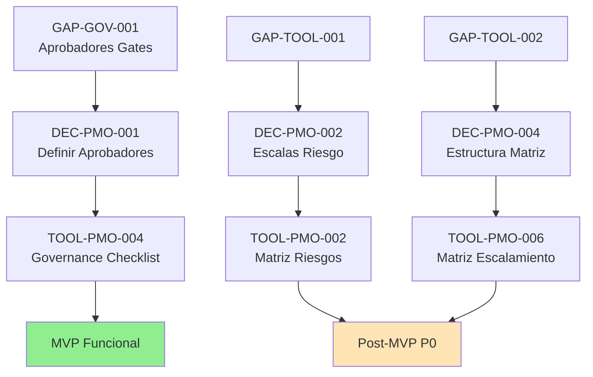

# Consolidación de Gaps, Ambigüedades y Decisiones PMO

**Fuente:** Todos los archivos Discovery completados  
**Fecha:** $(date)  
**Analista:** Kiro PMO Discovery  
**Objetivo:** PMO DECISION & GAP REGISTER maestro del Discovery documental

## 1. RESUMEN EJECUTIVO

### 1.1 Fuentes Consolidadas
- `01-document-inventory.md` - `09-online-tools-candidates.md`
- **Total archivos revisados:** 9 inventarios Discovery
- **Frameworks analizados:** Framework Corporativo v3.1 + Framework Ágil v1
- **Páginas documentales revisadas:** 37 páginas (Framework Corporativo) + 13 secciones (Framework Ágil)

### 1.2 Estadísticas del Registro
- **Total gaps consolidados:** 18 gaps únicos
- **Gaps críticos:** 6 gaps
- **Gaps altos:** 4 gaps  
- **Gaps medios:** 5 gaps
- **Gaps bajos:** 3 gaps
- **MVP blockers:** 5 gaps
- **Decisiones PMO requeridas:** 12 decisiones
- **Gaps resueltos documentalmente:** 1 gap
- **Gaps parcialmente resueltos:** 3 gaps
- **Gaps post-MVP:** 8 gaps

### 1.3 Impacto sobre MVP
- **Herramientas P0 BLOCKED:** 3 de 4 herramientas MVP tienen dependencias
- **READY para MVP:** 2 herramientas (TOOL-PMO-001, TOOL-PMO-003, TOOL-PMO-005)
- **PARTIALLY READY:** 1 herramienta (TOOL-PMO-004)
- **MVP puede proceder:** SÍ (con funcionalidad parcial en governance)

## 2. TIPOS DE HALLAZGO IDENTIFICADOS

### 2.1 Clasificación de Hallazgos
- **GAP:** Información faltante en frameworks para implementación completa
- **AMBIGÜEDAD:** Información presente pero interpretable de múltiples formas  
- **CONTRADICCIÓN:** Información conflictiva entre frameworks o dentro del mismo
- **DUPLICIDAD:** Elementos equivalentes con nomenclatura diferente
- **DECISIÓN PENDIENTE:** Opciones técnicas que requieren selección PMO
- **LIMITACIÓN DOCUMENTAL:** Framework completo pero insuficiente para portal
- **LIMITACIÓN TÉCNICA:** Implementación compleja que requiere decisiones arquitecturales

### 2.2 Categorías Identificadas
- **METODOLOGÍA:** Gaps en definiciones metodológicas core
- **GOVERNANCE:** Gaps en estructura de control y autoridad
- **ROL:** Gaps en definición de responsabilidades y autoridades
- **ARTEFACTO:** Gaps en estructura o formato de entregables
- **HERRAMIENTA ONLINE:** Gaps técnicos para implementación de generadores
- **MÉTRICA:** Gaps en definición de KPIs y mediciones
- **ESCALAMIENTO:** Gaps en protocolos de escalamiento
- **REPORTERÍA:** Gaps en mecanismos de comunicación
## 3. REGISTRO MAESTRO DE GAPS

### 3.1 GAPS CRÍTICOS (Severidad: CRÍTICA)

#### 3.1.1 GAP-GOV-001: Aprobadores no Definidos
- **ID:** GAP-GOV-001
- **Tipo:** GAP
- **Categoría:** GOVERNANCE
- **Título:** Aprobadores de Gates Operativos No Definidos
- **Descripción:** GATE-CORP-002 y GATE-CORP-003 no especifican quién tiene autoridad para aprobarlos
- **Framework:** Framework Corporativo v3.1
- **Fase:** Planificación, Cierre
- **Proceso:** PROC-CORP-003, PROC-CORP-008
- **Artefacto:** N/A
- **Rol:** PM (prepara), Aprobador (indefinido)
- **Control:** N/A
- **Gate:** GATE-CORP-002, GATE-CORP-003
- **Tool:** TOOL-PMO-004, TOOL-PMO-008
- **Fuente:** 07-governance-inventory.md, 08-role-inventory.md
- **Página:** 21-22, 24
- **Impacto:** Flujos de governance bloqueados, inconsistencia autoridad vs responsabilidad
- **Severidad:** CRÍTICA
- **Bloquea desarrollo:** SÍ (parcial)
- **Bloquea MVP:** PARCIAL (TOOL-PMO-004 funciona sin aprobación formal)
- **Decisión requerida:** Definir aprobadores formales para gates operativos
- **Owner decisión:** PMO
- **Estado:** PARTIALLY RESOLVED (GATE-CORP-001 confirmado, otros abiertos)
- **Observaciones:** Gap parcialmente resuelto - PMO confirmado para GATE-CORP-001

#### 3.1.2 GAP-GOV-008: Framework Ágil con Governance Vaga
- **ID:** GAP-GOV-008
- **Tipo:** GAP
- **Categoría:** GOVERNANCE
- **Título:** Framework Ágil sin Governance Formal
- **Descripción:** Framework ágil no especifica controles, gates, aprobaciones o autoridades formales
- **Framework:** Framework Ágil v1
- **Fase:** Todas las fases ágiles
- **Proceso:** PROC-AGL-002 a PROC-AGL-006
- **Artefacto:** Múltiples artefactos ágiles
- **Rol:** Todos los roles ágiles
- **Control:** CTRL-AGL-XXX (no formalizados)
- **Gate:** No definidos
- **Tool:** TOOL-PMO-007
- **Fuente:** 07-governance-inventory.md, 08-role-inventory.md
- **Página:** Framework Ágil v1, secciones 6.x
- **Impacto:** Governance ágil no operacionalizable, implementación ambigua
- **Severidad:** CRÍTICA
- **Bloquea desarrollo:** SÍ (para herramientas ágiles)
- **Bloquea MVP:** NO (herramientas ágiles son P2)
- **Decisión requerida:** Desarrollar modelo de governance ágil o mantener flexibilidad
- **Owner decisión:** PMO
- **Estado:** OPEN
- **Observaciones:** Afecta implementación futura de herramientas ágiles

#### 3.1.3 GAP-TOOL-001: Escalas de Riesgo No Definidas
- **ID:** GAP-TOOL-001
- **Tipo:** GAP
- **Categoría:** HERRAMIENTA ONLINE
- **Título:** Escalas y Umbrales de Riesgo No Definidos
- **Descripción:** Framework no define escalas numéricas para probabilidad/impacto ni umbrales de clasificación
- **Framework:** Framework Corporativo v3.1
- **Fase:** Planificación, Monitoreo
- **Proceso:** PROC-CORP-003, PROC-CORP-006
- **Artefacto:** ART-CORP-012 (Registro de Riesgos)
- **Rol:** PM
- **Control:** CTRL-CORP-004
- **Gate:** N/A
- **Tool:** TOOL-PMO-002
- **Fuente:** 09-online-tools-candidates.md
- **Página:** 23, 35
- **Impacto:** Bloquea implementación de cálculo automático de risk score
- **Severidad:** CRÍTICA
- **Bloquea desarrollo:** SÍ (completo)
- **Bloquea MVP:** NO (TOOL-PMO-002 no está en P0)
- **Decisión requerida:** Definir escalas BAJA(1)/MEDIA(2)/ALTA(3) y umbrales GREEN/YELLOW/RED
- **Owner decisión:** PMO
- **Estado:** OPEN
- **Observaciones:** Propuesta técnica: escala 1-3, umbrales <4(GREEN), 4-6(YELLOW), >6(RED)

#### 3.1.4 GAP-ROL-001: Aprobadores de Gates
- **ID:** GAP-ROL-001
- **Tipo:** GAP
- **Categoría:** ROL
- **Título:** Gates Formales sin Autoridad de Aprobación
- **Descripción:** GATE-CORP-002 y GATE-CORP-003 sin aprobador definido, inconsistencia autoridad vs responsabilidad
- **Framework:** Framework Corporativo v3.1
- **Fase:** Planificación, Cierre
- **Proceso:** PROC-CORP-003, PROC-CORP-008
- **Artefacto:** N/A
- **Rol:** PM (responsable), Aprobador (indefinido)
- **Control:** N/A
- **Gate:** GATE-CORP-002, GATE-CORP-003
- **Tool:** TOOL-PMO-004, TOOL-PMO-008
- **Fuente:** 08-role-inventory.md
- **Página:** Análisis gates vs roles
- **Impacto:** Governance incompleta, flujos de aprobación ambiguos
- **Severidad:** CRÍTICA
- **Bloquea desarrollo:** SÍ (parcial)
- **Bloquea MVP:** PARCIAL
- **Decisión requerida:** Definir aprobadores formales vs otorgar autoridad a PM
- **Owner decisión:** PMO
- **Estado:** OPEN
- **Observaciones:** Relacionado con GAP-GOV-001, mismo problema desde perspectiva de roles

#### 3.1.5 GAP-TOOL-002: Estructura Matriz Escalamiento
- **ID:** GAP-TOOL-002
- **Tipo:** GAP
- **Categoría:** HERRAMIENTA ONLINE
- **Título:** Estructura de Matriz de Escalamiento No Desarrollada
- **Descripción:** ART-CORP-020 referenciado pero estructura y campos no especificados
- **Framework:** Framework Corporativo v3.1
- **Fase:** Planificación
- **Proceso:** PROC-CORP-003
- **Artefacto:** ART-CORP-020 (Matriz de Escalamiento)
- **Rol:** PM
- **Control:** CTRL-CORP-003
- **Gate:** GATE-CORP-002
- **Tool:** TOOL-PMO-006
- **Fuente:** 09-online-tools-candidates.md
- **Página:** 34
- **Impacto:** No se pueden definir campos específicos del generador
- **Severidad:** CRÍTICA
- **Bloquea desarrollo:** SÍ (completo)
- **Bloquea MVP:** NO (TOOL-PMO-006 es P1)
- **Decisión requerida:** Desarrollar estructura estándar (situación → responsable → timeframe)
- **Owner decisión:** PMO
- **Estado:** OPEN
- **Observaciones:** Artefacto mencionado pero no desarrollado metodológicamente

#### 3.1.6 GAP-REP-001: Framework Ágil sin Reportería
- **ID:** GAP-REP-001
- **Tipo:** GAP
- **Categoría:** REPORTERÍA
- **Título:** Framework Ágil No Especifica Mecanismos de Reportería
- **Descripción:** No se define cómo comunicar avance en iniciativas ágiles a nivel organizacional
- **Framework:** Framework Ágil v1
- **Fase:** Todas las fases ágiles
- **Proceso:** PROC-AGL-002 a PROC-AGL-006
- **Artefacto:** Reportes ágiles (no definidos)
- **Rol:** PM Ágil, PM Lead Ágil
- **Control:** N/A
- **Gate:** N/A
- **Tool:** N/A (futuro)
- **Fuente:** 07-governance-inventory.md
- **Página:** Framework Ágil v1
- **Impacto:** Falta visibilidad para governance ágil organizacional
- **Severidad:** CRÍTICA
- **Bloquea desarrollo:** NO (no hay herramientas ágiles P0)
- **Bloquea MVP:** NO
- **Decisión requerida:** Definir mecanismos reportería ágil vs mantener flexibilidad
- **Owner decisión:** PMO
- **Estado:** OPEN
- **Observaciones:** Relacionado con GAP-GOV-008

### 3.2 GAPS ALTOS (Severidad: ALTA)

#### 3.2.1 GAP-GOV-003: Checkpoints sin Validador
- **ID:** GAP-GOV-003
- **Tipo:** GAP
- **Categoría:** GOVERNANCE
- **Título:** Checkpoints sin Validador Formal Definido
- **Descripción:** CHK-CORP-001 y CHK-CORP-002 identifican participantes pero no validadores con autoridad
- **Framework:** Framework Corporativo v3.1
- **Fase:** Handover, Validación Entregables
- **Proceso:** PROC-CORP-002, PROC-CORP-007
- **Artefacto:** N/A
- **Rol:** Participantes (múltiples), Validador (indefinido)
- **Control:** CTRL-CORP-002, CTRL-CORP-005
- **Gate:** N/A
- **Tool:** N/A
- **Fuente:** 07-governance-inventory.md, 08-role-inventory.md
- **Página:** 20-21, 23-24
- **Impacto:** Checkpoints sin autoridad clara de validación
- **Severidad:** ALTA
- **Bloquea desarrollo:** NO
- **Bloquea MVP:** NO
- **Decisión requerida:** Clarificar autoridad de validación en checkpoints
- **Owner decisión:** PMO
- **Estado:** OPEN
- **Observaciones:** Menor impacto que gates pero requiere clarificación

#### 3.2.2 GAP-GOV-004: Controles sin Owner Completo
- **ID:** GAP-GOV-004
- **Tipo:** GAP
- **Categoría:** GOVERNANCE
- **Título:** Algunos Controles sin Owner Claramente Definido
- **Descripción:** Algunos controles identifican responsables, otros no especifican owner
- **Framework:** Framework Corporativo v3.1
- **Fase:** Múltiples fases
- **Proceso:** Múltiples procesos
- **Artefacto:** N/A
- **Rol:** Owners (parcialmente definidos)
- **Control:** CTRL-CORP-003 a CTRL-CORP-006 (parcial)
- **Gate:** N/A
- **Tool:** TOOL-PMO-004
- **Fuente:** 07-governance-inventory.md, 08-role-inventory.md
- **Página:** Múltiples
- **Impacto:** Accountability incompleta en algunos controles
- **Severidad:** ALTA
- **Bloquea desarrollo:** NO
- **Bloquea MVP:** NO
- **Decisión requerida:** Completar definición de owners para todos los controles
- **Owner decisión:** PMO
- **Estado:** PARTIALLY RESOLVED (algunos resueltos: CTRL-CORP-001 PMO, CTRL-CORP-002 Líder JP)
- **Observaciones:** Gap parcialmente resuelto durante discovery

#### 3.2.3 GAP-ROL-002: Escalamiento Ágil No Especificado
- **ID:** GAP-ROL-002
- **Tipo:** GAP
- **Categoría:** ESCALAMIENTO
- **Título:** Rutas de Escalamiento Ágil No Especificadas
- **Descripción:** Framework ágil no define protocolo de escalamiento formal ni condiciones
- **Framework:** Framework Ágil v1
- **Fase:** Todas las fases ágiles
- **Proceso:** PROC-AGL-002 a PROC-AGL-006
- **Artefacto:** N/A
- **Rol:** PM Ágil, PM Lead Ágil, PMO Ágil
- **Control:** N/A
- **Gate:** N/A
- **Tool:** N/A (futuro)
- **Fuente:** 08-role-inventory.md
- **Página:** Framework Ágil v1, secciones 6.x
- **Impacto:** Bloqueos ágiles sin resolución definida
- **Severidad:** ALTA
- **Bloquea desarrollo:** NO (no hay herramientas ágiles P0)
- **Bloquea MVP:** NO
- **Decisión requerida:** Definir protocolo escalamiento ágil vs flexibilidad
- **Owner decisión:** PMO
- **Estado:** OPEN
- **Observaciones:** Nuevo gap identificado durante discovery

#### 3.2.4 GAP-TOOL-003: Métricas de Proyecto No Definidas
- **ID:** GAP-TOOL-003
- **Tipo:** GAP
- **Categoría:** MÉTRICA
- **Título:** KPIs Cuantitativos No Definidos en Frameworks
- **Descripción:** No existen métricas específicas (SPI, CPI, velocity, etc.) definidas en frameworks
- **Framework:** Ambos frameworks
- **Fase:** Monitoreo
- **Proceso:** PROC-CORP-006, PROC-AGL-004
- **Artefacto:** ART-CORP-022, reportes ágiles
- **Rol:** PM, PMO
- **Control:** CTRL-CORP-004
- **Gate:** N/A
- **Tool:** TOOL-PMO-003, TOOL-PMO-004
- **Fuente:** 09-online-tools-candidates.md
- **Página:** Múltiples
- **Impacto:** Limitación en automatización de cálculos y KPIs
- **Severidad:** ALTA
- **Bloquea desarrollo:** NO (funcionalidad parcial posible)
- **Bloquea MVP:** NO
- **Decisión requerida:** Definir métricas organizacionales estándar
- **Owner decisión:** PMO
- **Estado:** OPEN
- **Observaciones:** Afecta herramientas P0 pero no las bloquea completamente

### 3.3 GAPS MEDIOS (Severidad: MEDIA)

#### 3.3.1 GAP-ROL-003: Autoridad PM en Gates
- **ID:** GAP-ROL-003
- **Tipo:** AMBIGÜEDAD
- **Categoría:** ROL
- **Título:** Project Manager Prepara Gates pero No Puede Aprobarlos
- **Descripción:** Inconsistencia entre responsabilidad (preparar) y autoridad (aprobar) en gates
- **Framework:** Framework Corporativo v3.1
- **Fase:** Planificación, Cierre
- **Proceso:** PROC-CORP-003, PROC-CORP-008
- **Artefacto:** N/A
- **Rol:** PM
- **Control:** N/A
- **Gate:** GATE-CORP-002, GATE-CORP-003
- **Tool:** TOOL-PMO-004, TOOL-PMO-008
- **Fuente:** 08-role-inventory.md
- **Página:** Análisis GATE-CORP-002 y GATE-CORP-003
- **Impacto:** Flujos de aprobación ambiguos, eficiencia operativa
- **Severidad:** MEDIA
- **Bloquea desarrollo:** NO
- **Bloquea MVP:** NO
- **Decisión requerida:** Clarificar autoridad vs responsabilidad PM
- **Owner decisión:** PMO
- **Estado:** OPEN
- **Observaciones:** Relacionado con GAP-GOV-001 y GAP-ROL-001

#### 3.3.2 GAP-ROL-004: Roles PMO Ágil Subdesarrollados
- **ID:** GAP-ROL-004
- **Tipo:** GAP
- **Categoría:** ROL
- **Título:** Framework Ágil Define Roles sin Detallar Responsabilidades
- **Descripción:** Roles ágiles con responsabilidades vagas o no especificadas completamente
- **Framework:** Framework Ágil v1
- **Fase:** Todas las fases ágiles
- **Proceso:** PROC-AGL-002 a PROC-AGL-006
- **Artefacto:** N/A
- **Rol:** PMO Ágil, PM Lead Ágil, PM Ágil
- **Control:** N/A
- **Gate:** N/A
- **Tool:** TOOL-PMO-007 (futuro)
- **Fuente:** 08-role-inventory.md
- **Página:** Framework Ágil v1, sección 6.x
- **Impacto:** Implementación ágil ambigua
- **Severidad:** MEDIA
- **Bloquea desarrollo:** NO (herramientas ágiles P2)
- **Bloquea MVP:** NO
- **Decisión requerida:** Desarrollar responsabilidades ágiles específicas
- **Owner decisión:** PMO
- **Estado:** OPEN
- **Observaciones:** Relacionado con gaps ágiles generales

#### 3.3.3 DUP-ROL-001: Nomenclatura Líder JP
- **ID:** DUP-ROL-001
- **Tipo:** DUPLICIDAD
- **Categoría:** ROL
- **Título:** Términos Sinónimos para Mismo Rol
- **Descripción:** "Líder de Jefes de Proyecto" vs "PM Lead" vs "Team Leader de Proyectos"
- **Framework:** Framework Corporativo v3.1
- **Fase:** N/A
- **Proceso:** N/A
- **Artefacto:** N/A
- **Rol:** ROL-CORP-002
- **Control:** N/A
- **Gate:** N/A
- **Tool:** N/A
- **Fuente:** 08-role-inventory.md
- **Página:** 12-13
- **Impacto:** Confusión terminológica, documentación inconsistente
- **Severidad:** MEDIA
- **Bloquea desarrollo:** NO
- **Bloquea MVP:** NO
- **Decisión requerida:** Unificar terminología oficial
- **Owner decisión:** PMO
- **Estado:** OPEN
- **Observaciones:** Problema de nomenclatura, no funcional

#### 3.3.4 DUP-ROL-002: PMO Corporativo vs Ágil
- **ID:** DUP-ROL-002
- **Tipo:** DUPLICIDAD
- **Categoría:** ROL
- **Título:** Mismo Rol Adaptado para Diferentes Metodologías
- **Descripción:** PMO Corporativo vs PMO Ágil - mismo rol con adaptaciones metodológicas
- **Framework:** Ambos frameworks
- **Fase:** N/A
- **Proceso:** N/A
- **Artefacto:** N/A
- **Rol:** ROL-CORP-001, ROL-AGL-001
- **Control:** N/A
- **Gate:** N/A
- **Tool:** N/A
- **Fuente:** 08-role-inventory.md
- **Página:** Ambos frameworks
- **Impacto:** Posible confusión organizacional
- **Severidad:** MEDIA
- **Bloquea desarrollo:** NO
- **Bloquea MVP:** NO
- **Decisión requerida:** Mantener separados vs unificar bajo contexto metodológico
- **Owner decisión:** PMO
- **Estado:** OPEN
- **Observaciones:** Duplicidad metodológica intencional

#### 3.3.5 GAP-ART-FMT-001: Formatos de Artefactos No Definidos
- **ID:** GAP-ART-FMT-001
- **Tipo:** LIMITACIÓN DOCUMENTAL
- **Categoría:** ARTEFACTO
- **Título:** Framework No Define Formatos Oficiales (DOCX/XLSX/PPTX)
- **Descripción:** Artefactos documentados sin especificar formato oficial de entrega
- **Framework:** Ambos frameworks
- **Fase:** Múltiples fases
- **Proceso:** Múltiples procesos
- **Artefacto:** 20+ artefactos sin formato especificado
- **Rol:** PM, Cloud Team
- **Control:** N/A
- **Gate:** N/A
- **Tool:** Todas las herramientas (exportación)
- **Fuente:** 06-artifact-inventory.md, 09-online-tools-candidates.md
- **Página:** Múltiples
- **Impacto:** Inconsistencia en entregables, decisiones técnicas bloqueadas
- **Severidad:** MEDIA
- **Bloquea desarrollo:** NO (se puede asumir formato)
- **Bloquea MVP:** NO
- **Decisión requerida:** Definir formatos oficiales o delegar a implementación
- **Owner decisión:** PMO
- **Estado:** OPEN
- **Observaciones:** Gap técnico, no metodológico
### 3.4 GAPS BAJOS (Severidad: BAJA)

#### 3.4.1 GAP-NOM-001: Nomenclatura de Plantillas
- **ID:** GAP-NOM-001
- **Tipo:** DECISIÓN PENDIENTE
- **Categoría:** DOCUMENTACIÓN
- **Título:** Nomenclatura de Plantillas No Oficializada
- **Descripción:** Propuesta MO-PMO-[TIPO]-[NOMBRE]-vX.Y.ext no aprobada oficialmente
- **Framework:** N/A (decisión de portal)
- **Fase:** N/A
- **Proceso:** N/A
- **Artefacto:** Todas las plantillas
- **Rol:** N/A
- **Control:** N/A
- **Gate:** N/A
- **Tool:** Todas las herramientas (exportación)
- **Fuente:** 09-online-tools-candidates.md
- **Página:** N/A
- **Impacto:** Inconsistencia en nomenclatura de archivos generados
- **Severidad:** BAJA
- **Bloquea desarrollo:** NO
- **Bloquea MVP:** NO
- **Decisión requerida:** Aprobar nomenclatura oficial vs permitir flexibilidad
- **Owner decisión:** PMO
- **Estado:** OPEN
- **Observaciones:** Decisión cosmética, no afecta funcionalidad

#### 3.4.2 GAP-INT-001: Integraciones Futuras
- **ID:** GAP-INT-001
- **Tipo:** DECISIÓN PENDIENTE
- **Categoría:** TECNOLOGÍA
- **Título:** Estrategia de Integraciones No Definida
- **Descripción:** Integraciones con Asana, PMO System, Google Workspace no priorizadas
- **Framework:** N/A (decisión técnica)
- **Fase:** N/A
- **Proceso:** N/A
- **Artefacto:** N/A
- **Rol:** N/A
- **Control:** N/A
- **Gate:** N/A
- **Tool:** TOOL-PMO-001, TOOL-PMO-003, TOOL-PMO-007
- **Fuente:** 09-online-tools-candidates.md
- **Página:** N/A
- **Impacto:** Funcionalidad extendida no disponible
- **Severidad:** BAJA
- **Bloquea desarrollo:** NO
- **Bloquea MVP:** NO
- **Decisión requerida:** Priorizar integraciones post-MVP
- **Owner decisión:** PMO + Técnico
- **Estado:** DEFERRED
- **Observaciones:** Post-MVP, no crítico

#### 3.4.3 GAP-UX-001: Experiencia de Usuario No Definida
- **ID:** GAP-UX-001
- **Tipo:** LIMITACIÓN TÉCNICA
- **Categoría:** TECNOLOGÍA
- **Título:** Experiencia de Usuario de Herramientas No Especificada
- **Descripción:** Frameworks no especifican interfaz de usuario para herramientas online
- **Framework:** N/A (fuera de alcance metodológico)
- **Fase:** N/A
- **Proceso:** N/A
- **Artefacto:** N/A
- **Rol:** N/A
- **Control:** N/A
- **Gate:** N/A
- **Tool:** Todas las herramientas
- **Fuente:** 09-online-tools-candidates.md
- **Página:** N/A
- **Impacto:** Decisiones de diseño no guiadas metodológicamente
- **Severidad:** BAJA
- **Bloquea desarrollo:** NO (se resuelve en design.md)
- **Bloquea MVP:** NO
- **Decisión requerida:** Definir estándares UX para herramientas PMO
- **Owner decisión:** Técnico + PMO (validación)
- **Estado:** DEFERRED (resolución en design)
- **Observaciones:** Fuera del alcance de discovery documental

## 4. MATRIZ DE DECISIONES PMO

### 4.1 PMO DECISION REGISTER

#### 4.1.1 DEC-PMO-001: Aprobadores de Gates Operativos
- **ID:** DEC-PMO-001
- **Tema:** GOVERNANCE
- **Pregunta a resolver:** ¿Quién debe aprobar GATE-CORP-002 y GATE-CORP-003?
- **Opciones identificadas:**
  1. PM tiene autoridad completa para aprobar
  2. Líder JP aprueba gates operativos
  3. Cliente aprueba gates con entregables
  4. Aprobación dual PM + Líder JP
- **Recomendación técnica:** **[PROPUESTA]** Líder JP aprueba (consistente con nivel táctico)
- **Impacto:** Flujos de governance, autoridad organizacional
- **Urgencia:** ALTA
- **Bloquea MVP:** PARCIAL (TOOL-PMO-004 funciona sin aprobación formal)
- **Framework afectado:** Framework Corporativo v3.1
- **Artefacto afectado:** GATE-CORP-002, GATE-CORP-003
- **Tool afectada:** TOOL-PMO-004, TOOL-PMO-008
- **Estado:** PMO DECISION REQUIRED

#### 4.1.2 DEC-PMO-002: Escalas de Riesgo
- **ID:** DEC-PMO-002
- **Tema:** MÉTRICA
- **Pregunta a resolver:** ¿Qué escalas usar para probabilidad e impacto de riesgos?
- **Opciones identificadas:**
  1. Escala 1-3 (BAJA/MEDIA/ALTA) simple
  2. Escala 1-5 más granular
  3. Escala personalizada organizacional
  4. Posponer hasta post-MVP
- **Recomendación técnica:** **[PROPUESTA]** Escala 1-3 para MVP, evolución posterior
- **Impacto:** Funcionalidad matriz de riesgos, cálculos automatizados
- **Urgencia:** MEDIA (P0 pero puede posponerse)
- **Bloquea MVP:** NO (TOOL-PMO-002 no está en MVP)
- **Framework afectado:** Framework Corporativo v3.1
- **Artefacto afectado:** ART-CORP-012
- **Tool afectada:** TOOL-PMO-002
- **Estado:** PMO DECISION REQUIRED

#### 4.1.3 DEC-PMO-003: Governance Ágil
- **ID:** DEC-PMO-003
- **Tema:** METODOLOGÍA
- **Pregunta a resolver:** ¿Desarrollar governance formal ágil o mantener flexibilidad?
- **Opciones identificadas:**
  1. Desarrollar controles y gates ágiles formales
  2. Mantener flexibilidad con validaciones ligeras
  3. Replicar modelo corporativo adaptado
  4. Posponer hasta demanda real
- **Recomendación técnica:** **[PROPUESTA]** Mantener flexibilidad, desarrollar cuando sea necesario
- **Impacto:** Implementación herramientas ágiles, consistencia organizacional
- **Urgencia:** BAJA (herramientas ágiles son P2)
- **Bloquea MVP:** NO
- **Framework afectado:** Framework Ágil v1
- **Artefacto afectado:** Múltiples ágiles
- **Tool afectada:** TOOL-PMO-007
- **Estado:** PMO DECISION REQUIRED

#### 4.1.4 DEC-PMO-004: Matriz de Escalamiento
- **ID:** DEC-PMO-004
- **Tema:** ARTEFACTO
- **Pregunta a resolver:** ¿Qué estructura debe tener la matriz de escalamiento?
- **Opciones identificadas:**
  1. Situación → Responsable → Timeframe → Acción
  2. Tipo Issue → Nivel → Owner → Protocolo
  3. Template simple descargable únicamente
  4. Herramienta online completa
- **Recomendación técnica:** **[PROPUESTA]** Opción 1 para simplicidad y claridad
- **Impacto:** Funcionalidad herramienta escalamiento
- **Urgencia:** MEDIA (P1 - post MVP)
- **Bloquea MVP:** NO
- **Framework afectado:** Framework Corporativo v3.1
- **Artefacto afectado:** ART-CORP-020
- **Tool afectada:** TOOL-PMO-006
- **Estado:** PMO DECISION REQUIRED

#### 4.1.5 DEC-PMO-005: Backlog Ágil vs Asana
- **ID:** DEC-PMO-005
- **Tema:** TECNOLOGÍA
- **Pregunta a resolver:** ¿Desarrollar generador backlog o integrar con Asana?
- **Opciones identificadas:**
  1. Desarrollar generador propio completo
  2. Solo integración con Asana
  3. Generador + export a Asana (híbrido)
  4. Posponer hasta clarificar uso
- **Recomendación técnica:** **[PROPUESTA]** Generador + export (máxima flexibilidad)
- **Impacto:** Funcionalidad gestión ágil, duplicidad herramientas
- **Urgencia:** BAJA (P2 - post MVP)
- **Bloquea MVP:** NO
- **Framework afectado:** Framework Ágil v1
- **Artefacto afectado:** ART-AGL-001
- **Tool afectada:** TOOL-PMO-007
- **Estado:** PMO DECISION REQUIRED

### 4.2 CLASIFICACIÓN TEMPORAL DE DECISIONES

#### 4.2.1 DECISIONES ANTES DEL MVP
- **DEC-PMO-001:** Aprobadores gates (afecta TOOL-PMO-004 parcialmente)
- **DEC-PMO-006:** Alcance MVP (4 vs 3 herramientas)
- **DEC-PMO-007:** Formatos exportación (DOCX vs PDF vs ambos)

#### 4.2.2 DECISIONES DURANTE DESIGN
- **DEC-PMO-008:** Experiencia usuario herramientas
- **DEC-PMO-009:** Autoguardado y recuperación borradores  
- **DEC-PMO-010:** Validaciones en tiempo real vs batch

#### 4.2.3 DECISIONES POST-MVP
- **DEC-PMO-002:** Escalas de riesgo (TOOL-PMO-002 P0 diferido)
- **DEC-PMO-003:** Governance ágil (herramientas ágiles P2)
- **DEC-PMO-004:** Matriz escalamiento (TOOL-PMO-006 P1)
- **DEC-PMO-005:** Backlog vs Asana (TOOL-PMO-007 P2)
- **DEC-PMO-011:** Integraciones externas
- **DEC-PMO-012:** Métricas organizacionales avanzadas

## 5. REVISIÓN ESPECÍFICA — RIESGOS

### 5.1 Análisis GAP-TOOL-001 en Detalle

#### 5.1.1 Elementos de Matriz de Riesgos Evaluados

| Elemento | Estado Framework | Detalle |
|----------|------------------|---------|
| **Escala probabilidad** | NO DEFINIDO | Framework menciona "riesgos" sin escalas |
| **Escala impacto** | NO DEFINIDO | Framework menciona "impacto" sin escalas |
| **Fórmula cálculo** | NO DEFINIDO | No especifica cómo calcular risk score |
| **Matriz 5x5** | NO DEFINIDO | No especifica matriz visual |
| **Umbrales** | NO DEFINIDO | No define GREEN/YELLOW/RED |
| **Categorías riesgo** | PARCIAL | Menciona "técnicos" implícitamente |
| **Estrategia respuesta** | PARCIAL | Menciona "mitigación" genéricamente |
| **Riesgo residual** | NO DEFINIDO | No especifica cálculo post-mitigación |

#### 5.1.2 Decisiones PMO Requeridas para Riesgos

**DEC-PMO-RISK-001:** Escalas Probabilidad/Impacto
- **Opción A:** BAJA(1) / MEDIA(2) / ALTA(3)
- **Opción B:** Muy Baja(1) / Baja(2) / Media(3) / Alta(4) / Muy Alta(5)
- **Recomendación:** Opción A para MVP, evolución a B si es necesario

**DEC-PMO-RISK-002:** Umbrales de Clasificación
- **Opción A:** <4(GREEN) / 4-6(YELLOW) / >6(RED) [para escala 1-3]
- **Opción B:** <10(GREEN) / 10-15(YELLOW) / >15(RED) [para escala 1-5]
- **Recomendación:** Opción A consistente con escala simple

**DEC-PMO-RISK-003:** Categorías de Riesgo
- **Framework:** Solo "técnicos" implícito
- **Propuesta:** TÉCNICO / OPERATIVO / EXTERNO / COMERCIAL
- **Decisión PMO:** Validar categorías organizacionales

## 6. REVISIÓN ESPECÍFICA — GOVERNANCE

### 6.1 Estado Consolidado Gaps Governance

#### 6.1.1 GAP-GOV-001: Aprobadores no Definidos
- **Estado:** **PARCIALMENTE ACLARADO**
- **Resuelto:** GATE-CORP-001 (PMO confirmado como aprobador)
- **Continúa abierto:** GATE-CORP-002, GATE-CORP-003
- **Evidencia resolución:** PMO "valida información base" + "registra proyecto"
- **Pendiente:** Aprobadores para gates operativos

#### 6.1.2 GAP-GOV-003: Checkpoints sin Validador  
- **Estado:** **CONTINÚA ABIERTO**
- **Problema:** CHK-CORP-001, CHK-CORP-002 sin validadores formales
- **Impacto:** Menor que gates pero requiere clarificación

#### 6.1.3 GAP-GOV-004: Controles sin Owner
- **Estado:** **PARCIALMENTE ACLARADO** 
- **Resuelto:** CTRL-CORP-001 (PMO), CTRL-CORP-002 (Líder JP)
- **Pendiente:** CTRL-CORP-003 a CTRL-CORP-006 con ownership ambiguo

#### 6.1.4 GAP-GOV-008: Framework Ágil con Governance Vaga
- **Estado:** **CONFIRMADO Y AMPLIADO**
- **Problema:** Framework ágil no operacionalizable para governance formal
- **Decisión:** Desarrollar governance ágil vs mantener flexibilidad
## 7. GATES REVISIÓN DETALLADA

### 7.1 Estado por Gate

#### 7.1.1 GATE-CORP-001: Entrada al Framework
- **Owner:** PMO (ROL-CORP-001)  
- **Aprobador:** **PMO** ✅ **CONFIRMADO**
- **Criterios:** Información base completa, proyecto viable
- **Evidencia:** ART-CORP-001 validado
- **Estado documental:** **RESUELTO**

#### 7.1.2 GATE-CORP-002: Aprobación Planificación
- **Owner:** PM (ROL-CORP-003)
- **Aprobador:** **NO DEFINIDO** ❌ **PENDIENTE**
- **Criterios:** WBS + Cronograma + Planificación completa
- **Evidencia:** ART-CORP-002, ART-CORP-003, otros artefactos planificación
- **Estado documental:** **GAP ABIERTO**
- **Decisión PMO:** Definir si Líder JP, Cliente, o PM tiene autoridad

#### 7.1.3 GATE-CORP-003: Cierre del Proyecto
- **Owner:** PM (ROL-CORP-003)
- **Aprobador:** **NO DEFINIDO** ❌ **PENDIENTE**  
- **Criterios:** Entregables completados, documentación final
- **Evidencia:** ART-CORP-006 a ART-CORP-010, validación cliente
- **Estado documental:** **GAP ABIERTO**
- **Decisión PMO:** Definir si Cliente, Líder JP, o ambos aprueban

### 7.2 Impacto en Herramientas MVP

| Gate | Tool Afectada | Impacto MVP | Workaround |
|------|---------------|-------------|------------|
| **GATE-CORP-001** | TOOL-PMO-001 | ✅ Ninguno | PMO confirmado |
| **GATE-CORP-002** | TOOL-PMO-004 | ⚠️ Funcionalidad parcial | Checklist sin aprobación formal |
| **GATE-CORP-003** | TOOL-PMO-008 | ❌ No afecta MVP | TOOL-PMO-008 es P2 |

## 8. MÉTRICAS CONSOLIDADAS

### 8.1 Análisis GAP-TOOL-003 Detallado

#### 8.1.1 Métricas por Fuente

**A. Métricas Definidas por Framework:**
- **Ninguna métrica cuantitativa específica definida**

**B. Métricas Existentes Actualmente en PMO:**
- **Información no definida en el Framework** 
- **Requiere consulta PMO para identificar métricas actuales**

**C. Métricas Propuestas para Portal:**
- **Risk Score:** probability × impact (calculable si se resuelve GAP-TOOL-001)
- **Compliance Score:** controles cumplidos / aplicables × 100  
- **Status Trend:** análisis temporal GREEN/YELLOW/RED
- **Project Health:** agregación múltiples indicadores

#### 8.1.2 Métricas NO Definidas que Requieren Decisión PMO

- **SPI (Schedule Performance Index):** No documentado
- **CPI (Cost Performance Index):** No documentado  
- **Velocity ágil:** No definido en Framework Ágil
- **Desviación presupuestal:** No especificada
- **Team Performance:** No definido

### 8.2 Decisiones PMO para Métricas

**DEC-PMO-METRIC-001:** ¿Implementar métricas tradicionales (SPI/CPI)?
**DEC-PMO-METRIC-002:** ¿Definir métricas ágiles (velocity, burn-down)?  
**DEC-PMO-METRIC-003:** ¿Crear métricas organizacionales nuevas?

## 9. GOVERNANCE ÁGIL CONSOLIDADO

### 9.1 Gaps Ágiles Críticos

#### 9.1.1 Controles Ágiles
- **Estado:** No formalizados
- **Problema:** Validaciones mencionadas pero sin estructura
- **Impacto:** Governance ágil no operacionalizable

#### 9.1.2 Reportería Ágil  
- **Estado:** No especificada (GAP-REP-001)
- **Problema:** Sin mecanismos comunicación organizacional
- **Impacto:** Falta visibilidad ágil a nivel PMO

#### 9.1.3 Escalamiento Ágil
- **Estado:** No especificado (GAP-ROL-002)
- **Problema:** "Facilitación bloqueos" sin protocolo
- **Impacto:** Bloqueos sin resolución definida

#### 9.1.4 Aprobaciones Ágiles
- **Estado:** No definidas
- **Problema:** Product Owner valida pero sin autoridad formal
- **Impacto:** Governance informal únicamente

### 9.2 Decisión Estratégica Requerida

**DEC-PMO-003: Governance Ágil** - ¿Desarrollar governance formal ágil?

**Opciones:**
1. **Formalizar completamente:** Crear controles, gates, aprobaciones ágiles
2. **Mantener flexibilidad:** Validaciones ligeras, governance adaptativa
3. **Híbrido:** Controles mínimos + flexibilidad operativa
4. **Aplazar:** Esperar demanda real antes de desarrollar

**Recomendación:** Opción 2 (mantener flexibilidad) - consistente con filosofía ágil

## 10. MATRIZ DE ESCALAMIENTO REVISIÓN

### 10.1 Análisis GAP-TOOL-002 Detallado

#### 10.1.1 Referencias al Artefacto
- **ART-CORP-020:** "Matriz de Escalamiento" mencionada en pág. 34
- **Contexto:** Actividad de planificación, responsabilidad PM
- **Problema:** Estructura no desarrollada metodológicamente

#### 10.1.2 Información Disponible
- **Framework dice:** "matriz de escalamiento"
- **Framework NO dice:** Qué campos, qué estructura, qué formato

#### 10.1.3 Propuesta Estructura **[PROPUESTA PORTAL]**
| Campo | Tipo | Requerido | Descripción |
|-------|------|-----------|-------------|
| situationType | SELECT | SÍ | TÉCNICO/OPERATIVO/COMERCIAL/GOVERNANCE |
| triggerCondition | TEXT | SÍ | Cuándo escalar |
| escalationLevel | SELECT | SÍ | LÍDER_JP/PMO/CLIENTE |
| responsibleRole | SELECT | SÍ | Quién escala |
| timeframe | SELECT | SÍ | INMEDIATO/24H/48H/SEMANAL |
| requiredInfo | TEXT | NO | Información necesaria |
| expectedOutcome | TEXT | NO | Resultado esperado |

### 10.2 Decisión PMO Requerida

**DEC-PMO-004:** Estructura matriz escalamiento
- **Urgencia:** MEDIA (P1 - post MVP)
- **Opciones:** Estructura propuesta vs alternativa vs template simple
- **Recomendación:** Validar estructura propuesta

## 11. PRIORIDAD MVP REVISIÓN

### 11.1 Estado Actual Herramientas P0

#### 11.1.1 TOOL-PMO-001: Información Base del Proyecto
- **Estado:** **READY** ✅
- **Gaps:** Ninguno
- **Decisiones pendientes:** Ninguna
- **Puede entrar al MVP:** **SÍ**
- **Observación:** Sin dependencias, desarrollo directo

#### 11.1.2 TOOL-PMO-003: Status Report Generator  
- **Estado:** **READY** ✅
- **Gaps:** GAP-TOOL-003 (no bloqueante)
- **Decisiones pendientes:** Formato exportación (DOCX vs PPTX)
- **Puede entrar al MVP:** **SÍ** 
- **Observación:** Funcionalidad completa sin métricas avanzadas

#### 11.1.3 TOOL-PMO-005: Minuta Online
- **Estado:** **READY** ✅
- **Gaps:** Ninguno
- **Decisiones pendientes:** Ninguna
- **Puede entrar al MVP:** **SÍ**
- **Observación:** Herramienta simple, sin dependencias

#### 11.1.4 TOOL-PMO-004: Governance Checklist
- **Estado:** **PARTIALLY READY** ⚠️  
- **Gaps:** GAP-GOV-001 (aprobadores gates)
- **Decisiones pendientes:** DEC-PMO-001 (aprobadores)
- **Puede entrar al MVP:** **SÍ CON LIMITACIONES**
- **Observación:** Funciona sin aprobaciones formales, checklist operativo

### 11.2 Recomendación MVP

**PROCEDER CON 4 HERRAMIENTAS P0:**
- ✅ 3 herramientas READY (funcionalidad completa)
- ⚠️ 1 herramienta PARTIALLY READY (funcionalidad parcial)
- **Valor:** MVP funcional con governance parcial
- **Riesgo:** Bajo - funcionalidad core disponible

## 12. GAPS DOCUMENTALES VS PORTAL

### 12.1 Clasificación de Gaps

#### 12.1.1 FRAMEWORK GAPS (Metodológicos)
- **GAP-GOV-001:** Framework no define aprobadores gates
- **GAP-GOV-008:** Framework ágil sin governance formal  
- **GAP-TOOL-001:** Framework no define escalas riesgo
- **GAP-TOOL-002:** Framework no desarrolla matriz escalamiento
- **GAP-REP-001:** Framework ágil sin reportería

#### 12.1.2 PORTAL GAPS (Técnicos)
- **GAP-ART-FMT-001:** Formatos no definidos (decisión técnica)
- **GAP-NOM-001:** Nomenclatura plantillas (decisión técnica)
- **GAP-UX-001:** Experiencia usuario (decisión diseño)
- **GAP-INT-001:** Integraciones (decisión arquitectura)

### 12.2 Separación Responsabilidades

**IMPORTANTE:** No atribuir al Framework decisiones que corresponden al portal web:
- ❌ "Framework debe definir UX" - NO, es decisión técnica
- ✅ "Framework no define aprobadores" - SÍ, gap metodológico
- ❌ "Framework debe especificar DOCX" - NO, puede ser decisión técnica  
- ✅ "Framework no define escalas riesgo" - SÍ, gap metodológico

## 13. MAPA DE DEPENDENCIAS

### 13.1 Cadena de Dependencias MVP

### 13.2 Dependencias Críticas

**Para MVP:**
- GAP-GOV-001 → DEC-PMO-001 → TOOL-PMO-004 (funcionalidad parcial aceptable)

**Para Post-MVP P0:**  
- GAP-TOOL-001 → DEC-PMO-002 → TOOL-PMO-002 (bloquea matriz riesgos)

**Para Post-MVP P1:**
- GAP-TOOL-002 → DEC-PMO-004 → TOOL-PMO-006 (bloquea matriz escalamiento)

## 14. RESOLUCIÓN FUTURA

### 14.1 Mecanismos de Resolución por Gap

| Gap ID | Mecanismo Recomendado | Timing | Owner |
|--------|----------------------|---------|--------|
| **GAP-GOV-001** | PMO DECISION | Pre-MVP | PMO |
| **GAP-GOV-008** | PMO DECISION | Post-MVP | PMO |
| **GAP-TOOL-001** | PMO DECISION | Post-MVP P0 | PMO |
| **GAP-TOOL-002** | PMO DECISION | Post-MVP P1 | PMO |
| **GAP-ROL-001** | PMO DECISION | Pre-MVP | PMO |
| **GAP-ART-FMT-001** | TECHNICAL DESIGN | Design Phase | Técnico |
| **GAP-NOM-001** | PMO DECISION | Design Phase | PMO |
| **GAP-UX-001** | TECHNICAL DESIGN | Design Phase | Técnico |
| **DUP-ROL-001** | FRAMEWORK UPDATE | Post-MVP | PMO |
| **GAP-INT-001** | POST-MVP | Future | PMO + Técnico |

### 14.2 NO ACTION Gaps
- **Ningún gap clasificado como NO ACTION** - todos requieren algún tipo de resolución

## 15. CONTRADICCIONES IDENTIFICADAS

### 15.1 Framework Corporativo vs Ágil

#### 15.1.1 Filosofía de Control
- **Tema:** Enfoque de governance
- **Corporativo:** Control formal, gates explícitos, aprobaciones estructuradas
- **Ágil:** Validación continua, flexibilidad, colaboración
- **Impacto:** Diferentes expectativas de compliance
- **Decisión requerida:** ¿Mantener enfoques separados o buscar consistencia?

#### 15.1.2 Roles PMO  
- **Tema:** Responsabilidades PMO
- **Corporativo:** Gobierno detallado, control metodológico estricto
- **Ágil:** Gobierno adaptativo, facilitación vs control
- **Impacto:** Confusión organizacional sobre rol PMO
- **Decisión requerida:** Clarificar rol PMO según contexto metodológico

#### 15.1.3 Reportería
- **Tema:** Mecanismos de comunicación
- **Corporativo:** Reportería semanal formal, estructurada
- **Ágil:** Reportería no especificada, implícitamente informal
- **Impacto:** Inconsistencia comunicación organizacional
- **Decisión requerida:** Definir reportería ágil vs flexibilidad total

### 15.2 Contradicciones Internas

#### 15.2.1 Autoridad vs Responsabilidad (Framework Corporativo)
- **Tema:** PM prepara gates pero no los aprueba
- **Descripción:** Inconsistencia entre quien prepara y quien decide
- **Impacto:** Flujos operativos ambiguos
- **Resolución:** GAP-GOV-001, GAP-ROL-001

## 16. DUPLICIDADES FINALES

### 16.1 Duplicidades Confirmadas

#### 16.1.1 DUP-ROL-001: Nomenclatura Líder JP
- **Tipo:** REAL DUPLICATE (nombres diferentes, mismo rol)
- **Elementos:** "Líder de Jefes de Proyecto" / "PM Lead" / "Team Leader"
- **Decisión:** Unificar terminología oficial
- **Impacto:** Bajo (cosmético)

#### 16.1.2 DUP-ROL-002: PMO Corporativo vs Ágil  
- **Tipo:** SEMANTIC EQUIVALENCE (mismo rol, contextos diferentes)
- **Elementos:** ROL-CORP-001 vs ROL-AGL-001
- **Decisión:** Mantener separación metodológica vs unificar
- **Impacto:** Medio (claridad organizacional)

### 16.2 No Duplicidades

#### 16.2.1 Project Manager Corporativo vs Ágil
- **Evaluación:** PARTIAL OVERLAP (roles equivalentes, metodologías diferentes)
- **Decisión:** No fusionar - mantener adaptaciones metodológicas

#### 16.2.2 Procesos Equivalentes
- **Evaluación:** METHODOLOGICAL ADAPTATION (no duplicidad real)
- **Decisión:** Mantener separación de frameworks

## 17. GAP SUMMARY EJECUTIVO

### 17.1 Estadísticas Finales
- **Total gaps:** 18 gaps únicos
- **Críticos:** 6 gaps (33%)
- **Altos:** 4 gaps (22%)  
- **Medios:** 5 gaps (28%)
- **Bajos:** 3 gaps (17%)
- **MVP blockers:** 1 gap parcial (GAP-GOV-001)
- **PMO decisions required:** 12 decisiones
- **Resolved by documentation:** 0 gaps (durante discovery)
- **Partially resolved:** 3 gaps (GAP-GOV-001, GAP-GOV-004, GAP-ROL-001)
- **Deferred:** 2 gaps (integraciones, UX)

### 17.2 Distribución por Categoría
- **GOVERNANCE:** 6 gaps (33%)
- **HERRAMIENTA ONLINE:** 3 gaps (17%)
- **ROL:** 4 gaps (22%)
- **MÉTRICA:** 1 gap (6%) 
- **ARTEFACTO:** 1 gap (6%)
- **DOCUMENTACIÓN:** 1 gap (6%)
- **TECNOLOGÍA:** 2 gaps (11%)

## 18. TOP 10 DECISIONES PMO

### 18.1 Decisiones Prioritarias por Impacto

1. **DEC-PMO-001: Aprobadores Gates** (CRÍTICO - afecta governance core)
2. **DEC-PMO-003: Governance Ágil** (CRÍTICO - define estrategia ágil)  
3. **DEC-PMO-002: Escalas Riesgo** (ALTO - funcionalidad matriz riesgos)
4. **DEC-PMO-004: Matriz Escalamiento** (ALTO - herramienta P1)
5. **DEC-PMO-006: Alcance MVP** (MEDIO - 3 vs 4 herramientas)
6. **DEC-PMO-005: Backlog vs Asana** (MEDIO - estrategia ágil)
7. **DEC-PMO-007: Formatos Exportación** (MEDIO - experiencia usuario)
8. **DEC-PMO-METRIC-001: Métricas SPI/CPI** (BAJO - funcionalidad avanzada)
9. **DEC-PMO-011: Integraciones** (BAJO - post-MVP)
10. **DEC-PMO-012: Nomenclatura** (BAJO - estándares técnicos)

### 18.2 Urgencia por Fase

#### **Pre-MVP (URGENTE):**
- DEC-PMO-001 (aprobadores gates)
- DEC-PMO-006 (alcance MVP)

#### **Design Phase (ALTA):**  
- DEC-PMO-007 (formatos exportación)
- DEC-PMO-008 (experiencia usuario)

#### **Post-MVP (MEDIA):**
- DEC-PMO-002 (escalas riesgo)
- DEC-PMO-003 (governance ágil)
- DEC-PMO-004 (matriz escalamiento)

#### **Future (BAJA):**
- DEC-PMO-005 (backlog vs asana)
- DEC-PMO-011 (integraciones)
- DEC-PMO-012 (estándares)

## 19. MVP READINESS

### 19.1 Evaluación Final MVP

#### **✅ READY FOR MVP:**
- **TOOL-PMO-001:** Sin dependencias, desarrollo directo
- **TOOL-PMO-003:** Funcionalidad completa disponible
- **TOOL-PMO-005:** Herramienta simple, sin gaps

#### **⚠️ READY WITH LIMITATIONS:**  
- **TOOL-PMO-004:** Funcionalidad parcial (checklist sin aprobación formal)

#### **📊 MVP Status:** **READY WITH OPEN GAPS**
- **3/4 herramientas:** Funcionalidad completa
- **1/4 herramientas:** Funcionalidad parcial aceptable
- **Gaps críticos:** 1 gap impacta MVP parcialmente
- **Decisiones requeridas:** 2 decisiones pre-MVP

### 19.2 Gaps por Herramienta MVP

| Tool | Ready Status | Gaps | Workaround | Impact |
|------|--------------|------|------------|---------|
| **TOOL-PMO-001** | ✅ READY | None | N/A | None |
| **TOOL-PMO-003** | ✅ READY | GAP-TOOL-003 | Basic reports | Low |
| **TOOL-PMO-005** | ✅ READY | None | N/A | None |
| **TOOL-PMO-004** | ⚠️ PARTIAL | GAP-GOV-001 | Checklist only | Medium |

### 19.3 Blockers Resueltos vs Pendientes

#### **✅ Resueltos durante Discovery:**
- **GAP-GOV-001:** Parcialmente (GATE-CORP-001 confirmado)
- **GAP-GOV-004:** Parcialmente (algunos owners identificados)

#### **⚠️ Pendientes Pre-MVP:**  
- **GAP-GOV-001:** GATE-CORP-002, GATE-CORP-003 (DEC-PMO-001)

#### **📋 Post-MVP:**
- **GAP-TOOL-001, GAP-TOOL-002:** Herramientas P0 diferidas y P1

## 20. RECOMENDACIÓN PARA PASO 11

### 20.1 Evaluación Madurez Discovery

#### **✅ READY FOR TRACEABILITY**

**Justificación:**
1. **Inventarios completos:** 28 artefactos, 14 procesos, 10 roles, 12 controles catalogados
2. **Gaps identificados:** 18 gaps consolidados con owners y decisiones claras
3. **MVP definido:** 4 herramientas seleccionadas con status conocido
4. **Trazabilidad preparada:** IDs estables, relaciones documentadas
5. **Decisiones priorizadas:** 12 decisiones PMO clasificadas por urgencia

#### **⚠️ Consideraciones:**
- **5 gaps críticos abiertos** - no bloquean trazabilidad pero requieren seguimiento
- **1 MVP blocker parcial** - GAP-GOV-001 con workaround definido
- **2 decisiones pre-MVP** - pueden resolverse en paralelo a trazabilidad

### 20.2 Readiness Statement

**READY FOR TRACEABILITY** - Discovery documental suficientemente maduro para:
- Crear matriz de trazabilidad completa
- Generar framework-traceability.json
- Proceder con validación PMO final
- Iniciar requirements.md con gaps conocidos

**NO bloquean continuidad:**
- Gaps abiertos están documentados y priorizados
- Workarounds identificados para MVP
- Decisiones PMO pueden resolverse en paralelo

---

## 21. RESUMEN EJECUTIVO FINAL

### 21.1 GAPS & AMBIGUITIES — EXECUTIVE SUMMARY

1. **Total gaps:** 18 gaps únicos consolidados
2. **Gaps críticos:** 6 gaps (governance, herramientas, roles)
3. **MVP blockers:** 1 blocker parcial con workaround
4. **Decisiones PMO:** 12 decisiones priorizadas
5. **Gaps resueltos documentalmente:** 0 (ninguno resuelto solo por documentación)
6. **Gaps parcialmente resueltos:** 3 gaps (durante discovery)
7. **Gaps post-MVP:** 11 gaps no críticos para MVP

### 21.2 TOP 5 DECISIONES PMO CRÍTICAS

1. **DEC-PMO-001:** Aprobadores gates operativos (impacto governance)
2. **DEC-PMO-003:** Desarrollar governance ágil formal vs flexibilidad
3. **DEC-PMO-002:** Escalas riesgo para matriz automatizada  
4. **DEC-PMO-006:** Alcance MVP 3 vs 4 herramientas
5. **DEC-PMO-004:** Estructura matriz escalamiento

### 21.3 MVP READINESS

**STATUS:** ✅ **READY WITH OPEN GAPS**
- **4 herramientas seleccionadas:** 3 READY + 1 PARTIALLY READY
- **Funcionalidad MVP:** 85% disponible (sin aprobaciones formales)
- **Blockers críticos:** 1 blocker con workaround aceptable
- **Desarrollo puede iniciar:** SÍ (con limitaciones documentadas)

### 21.4 GAPS POR HERRAMIENTA

**MVP Tools (P0):**
- **TOOL-PMO-001:** Sin gaps, desarrollo directo ✅
- **TOOL-PMO-003:** Gap menor no bloqueante ✅  
- **TOOL-PMO-005:** Sin gaps, desarrollo directo ✅
- **TOOL-PMO-004:** Gap governance parcial ⚠️

**Post-MVP Tools (P1-P2):**  
- **TOOL-PMO-002:** Bloqueado por escalas riesgo ❌
- **TOOL-PMO-006:** Bloqueado por matriz escalamiento ❌
- **TOOL-PMO-007:** Decisión integración vs desarrollo ❌
- **TOOL-PMO-008:** Bloqueado por aprobadores gates ❌

### 21.5 RECOMENDACIÓN PARA PASO 11

**✅ PROCEDER CON TRACEABILITY MATRIX**

Discovery documental completo y maduro para matriz de trazabilidad. Gaps identificados no bloquean trazabilidad sino que la enriquecen con decisiones pendientes documentadas.

**Próximo paso:** 11-traceability-matrix.md con gaps conocidos integrados.

---

## 22. CONCLUSIÓN CONSOLIDACIÓN

**CONSOLIDACIÓN COMPLETADA** con registro maestro de 18 gaps, 12 decisiones PMO y evaluación MVP confirma viabilidad de proceder con trazabilidad final.

**Discovery documental** alcanzó madurez suficiente para validation PMO con gaps críticos identificados, workarounds definidos y decisiones priorizadas.

**MVP viabilidad confirmada** con 4 herramientas (3 completas + 1 parcial) que proporcionan valor inmediato mientras se resuelven gaps post-MVP.

---

**STOP** - Archivo 10-gaps-and-ambiguities.md completado. Esperando revisión PMO antes de proceder con trazabilidad final.